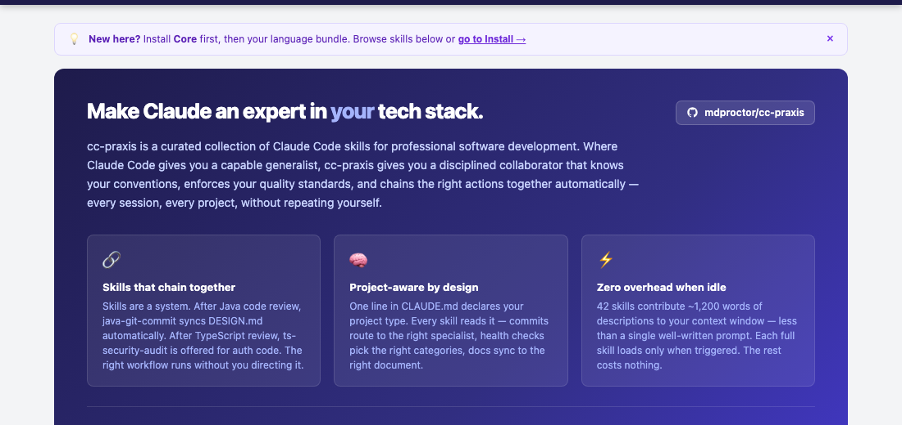
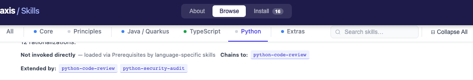
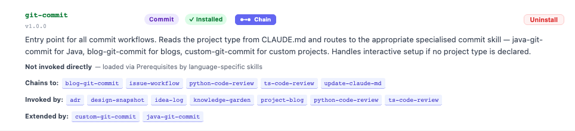
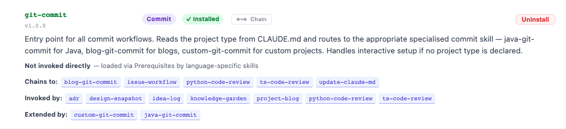
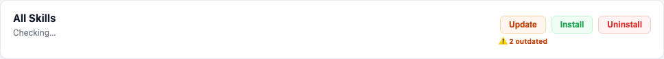
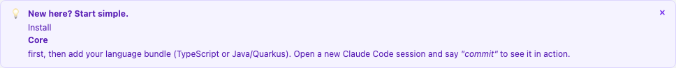
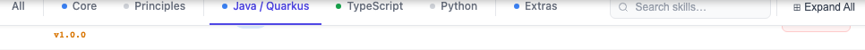
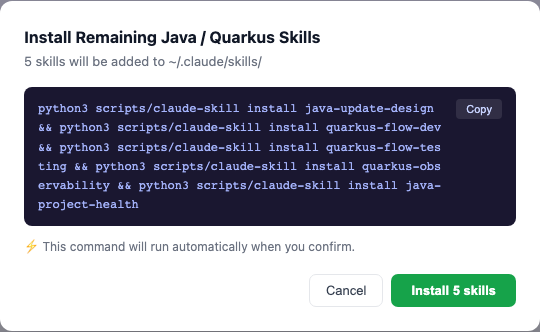
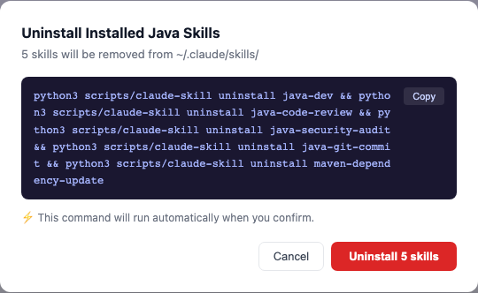
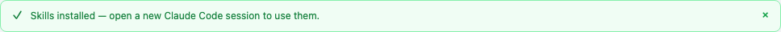

# cc-praxis Skill Manager — User Guide

The skill manager is a web interface for browsing, installing, and managing cc-praxis skills. It gives you a visual overview of all 48 skills, shows what's installed on your machine, and lets you install or remove skills with one click.

---

## Opening the Skill Manager

### Option A — Ask Claude to launch it

In any Claude Code session:

> "Open cc-praxis" or "launch the skill manager"

Claude starts the local server and opens your browser automatically.

### Option B — Run it yourself

```bash
python3 scripts/web_installer.py
```

Or, if the plugin is installed and `cc-praxis` is on your PATH:

```bash
cc-praxis
```

Both open `http://localhost:8765`.

### Viewing on GitHub Pages (Browse only)

If you visit the skill manager on GitHub Pages, the **Install** tab is hidden. You can browse all skills and explore the chain graph, but installing requires running the local server — only it can read `~/.claude/skills/` and execute commands on your machine.

---

## The Three Tabs


| Tab | Purpose |
|-----|---------|
| **About** | Overview — what cc-praxis does, how skills work, which languages are supported |
| **Browse** | Explore all 48 skills with descriptions and the interactive chain graph |
| **Install** | See what's installed on your machine and manage it |

When you switch to the Install tab, the execution mode controls appear on the right:


---

## The About Tab

The About tab is where new users start. It explains the value proposition, shows a before/after comparison, walks through a complete Java commit workflow as a worked example, and provides the one-line marketplace command to get started:



The stats bar — 48 skills, 5 bundles, 3 languages, 18 validators, 446 tests — reflects the real state of the collection. These numbers update when the collection grows.

At the bottom, the CTA offers two paths:


- **Browse Skills →** switches to the Browse tab to explore before committing
- **Install Now →** switches to the Install tab to get started immediately (when running locally) — or opens the GitHub repo (when viewed on GitHub Pages, where installing isn't possible)

---

## Browse — Exploring Skills

The sticky navigation bar lets you jump to any bundle or search across all skills:


The Browse tab shows all skills grouped into bundles. Click a bundle header to expand it.

### Skill Cards

Each skill card gives you everything you need to understand a skill:


The card contains:

- **Name and version** — the skill identifier and release
- **Role pill** — colour-coded category badge
- **Install status badge** — ✓ Installed (green) or Not installed (gray)
- **Description** — what the skill does and when it triggers
- **Chaining metadata** — which skills this connects to
- **Chain button** — opens the interactive dependency graph
- **Install / Uninstall** — quick action button

### Installing Directly from Browse

You don't need to switch to the Install tab to install a skill. Every Browse card has an Install or Uninstall button — whichever is appropriate given your current state:



This is the same install flow as the Install tab — it opens the confirmation modal, handles dependencies, and updates the badge live when done.

### Role Pills

| Pill | Category |
|------|---------|
| `Dev` (blue) | Development workflow |
| `Review` (amber) | Code review |
| `Security` (red) | Security audit |
| `Commit` (purple) | Git commit workflow |
| `Sync` (slate) | Document synchronisation |
| `Deps` (orange) | Dependency management |
| `Health` (green) | Project health checks |
| `Setup` (gray) | Installation wizards |
| `ADR` (slate) | Architecture documentation |
| `Foundation` (purple) | Universal base skills (not invoked directly) |

---

## Understanding Skill Relationships

Skills in cc-praxis form a connected system. There are three kinds of relationships.

### Chains To

When a skill finishes, it can offer to invoke another. "Chains to" means this skill will *offer* to hand off — you're always in control, chains are offers not forced sequences.

**Example:** `java-code-review` chains to `java-security-audit` when it detects auth, payment, or PII code.

### Invoked By

The reverse of "chains to." Shows which skills lead to this one.

**Example:** `update-claude-md` is invoked by every commit skill — `git-commit`, `java-git-commit`, `blog-git-commit`, and `custom-git-commit`.

### Builds On / Extended By

Some skills are built on top of foundations. The foundation provides universal rules; the specialist adds language depth.

```
code-review-principles  ◀── extended by ── java-code-review
                        ◀── extended by ── ts-code-review
                        ◀── extended by ── python-code-review
```

Foundation skills are never invoked directly — they load automatically when a specialist loads. When you install `java-code-review`, the skill manager includes `code-review-principles` in the install automatically.

> **Built-on parents are always installed with their children.** You never need to install foundation skills separately.

---

## The Chain Graph

Every skill card has a **Chain** button. Clicking it opens an inline panel showing that skill's position in the full dependency graph — ancestry on the left, the skill itself in bold, and its children on the right.

Here's the chain for `java-git-commit` — a skill partway through a chain:


Reading left to right:

- **⊙** — marks a root skill (no parent in the chain)
- **Ancestor names** — skills that lead here, from root to direct parent
- **Current skill** (bold, larger) — the skill whose card you opened
- **`▼` children** — skills this one chains to, listed vertically

Compare with `git-commit` itself — a root that starts all chains:


Root skills have no `⊙` and no ancestors — their panel shows only children.

### Grandchildren — Expanding Deeper

Children that have their own children show a **▼** / **▶** toggle. Click it to expand or collapse the grandchild level inline without opening a new panel:



This lets you explore multiple levels of the graph from a single panel.

### Navigating the Graph — Click to Jump

Every skill name inside the chain panel is clickable. Clicking it does three things simultaneously:

1. **Closes the current chain panel**
2. **Scrolls to that skill's card** (with a brief highlight pulse to orient you)
3. **Opens that skill's own chain panel**

This makes the chain graph a live navigation tool — you can walk the entire dependency graph by clicking through skills, tracing any path from root to leaf:



Click **×** at any point to close the panel entirely. Opening a new chain automatically closes any previously open one — only one chain is visible at a time.

> **Tip:** The chain panel inserts itself below the skill card if there's room, or above it if you're near the bottom of the viewport — so the content you're navigating to is always visible.

---

## Install — Managing Your Installation

### Live State Loading

When the Install tab first opens, the sync bar shows **"Checking…"** while reading `~/.claude/skills/`:



This updates within a second to show your real installed count. The counts you see always reflect the actual state of your filesystem — not a cached snapshot.

### The Sync Bar

Once loaded, the sync bar gives you an at-a-glance summary:


- **X of 48 installed** — skills present in `~/.claude/skills/`
- **⚠️ N outdated** — installed skills behind the latest release (only appears when applicable)
- **Update** — brings all installed skills to their latest versions
- **Install** — adds everything not yet installed
- **Uninstall** — removes all installed skills

### First-Time User Guidance

If you're new, the nudge box at the top of the Install tab gives you a recommended starting point:



Dismiss it with × once you've read it.

### Bundle States

The collapsed bundle view shows install state for every bundle at a glance:


| Indicator | Meaning |
|-----------|---------|
| **Green dot ●** | All skills in this bundle are installed |
| **Blue dot ◐** | Partial — some installed, some not |
| **Gray dot ○** | No skills installed |

The count ("5 of 10") shows exactly how many are present. Partial bundles show both **Install** and **Uninstall** — each operates only on the relevant subset.

### Individual Skill Rows

Expand a bundle to see each skill individually:


### Outdated Skills

When a skill has a newer version available, the version in the row is shown in amber with the upgrade path:



The amber indicator shows `current → available`. The ⚠️ count in the sync bar reflects the total number of outdated skills across all bundles.

---

## Installing Skills

### Installing a Bundle — Smart Install

When you click **Install** on a bundle header, the modal calculates exactly which skills in that bundle still need installing and operates only on those. It never attempts to reinstall skills you already have:



If you have 5 of 10 Java skills, it installs exactly the 5 you're missing. The label ("Install 5 skills") reflects the real count, computed from your actual install state at the moment you click.

### Installing a Single Skill — Dependency Auto-Resolution

When you install a skill that builds on a foundation, the modal automatically includes the foundation and explains why:


The blue notice lists which foundations will be pulled in. You don't need to know the dependency tree — the skill manager handles it.

> **You never need to install foundation skills manually.** Install the specialist; the foundations come with it.

---

## Uninstalling Skills — Smart Uninstall

The same precision applies to uninstall. Clicking **Uninstall** on a partial bundle calculates exactly which skills in that bundle are actually installed, and operates only on those:



The label shows the real count of what will be removed, not the total bundle size. You'll never see "Uninstall 10 skills" when only 5 are installed.

---

## Update — Moving Everything to One Version

**Update** is different from **Install**:

| Action | What it does |
|--------|-------------|
| **Install** | Adds skills not yet installed |
| **Uninstall** | Removes installed skills |
| **Update** | Brings *all installed* skills to their latest version as a set |

Skills in cc-praxis are designed to work together as a consistent set. `java-code-review` references conventions defined in `java-dev`. `git-commit` routes to specialists sharing the same commit format. Running different versions of related skills can cause subtle inconsistencies.

The update modal shows exactly what changes and links to the release notes:


If you've manually updated some skills but not others, the modal shows a mixed-version warning recommending you update all at once. This keeps the collection internally consistent.

---

## Auto Execute vs Show Command

The mode toggle controls what happens when you confirm:


### ⚡ Auto Execute (default)

The skill manager runs the command for you immediately when you confirm. When it completes, a persistent success banner appears at the top of the Install tab:



The banner stays visible until you dismiss it with ×. This matters because the next step — opening a new Claude Code session — is easy to forget when you're in the middle of something.

The install state (dots, counts) updates automatically after every Auto Execute action.

### 📋 Show Command

The modal shows the exact command but does not run it. Copy it and run it yourself in your terminal:


After running the command in your terminal, click **Done — Refresh** to reload the install state. The dots and counts update to reflect what's now in `~/.claude/skills/`.

Use Show Command if you want to review or audit the exact command before it runs, or if you prefer keeping all shell commands in your own terminal history.

---

## Searching for Skills

The search box in the navigation bar filters across both Browse and Install views simultaneously:


Results filter instantly as you type — matching on skill name or description text. Bundles with no matches collapse; bundles with matches auto-expand and show only matching skills.

Use **⊟ Collapse All** / **⊞ Expand All** to control bundle visibility.

---

## Refreshing the Install State

The install state loads on page open and refreshes automatically after every Auto Execute action. If you install or remove skills directly in your terminal:

```bash
python3 scripts/claude-skill install java-dev
```

Click **↻ Refresh** in the header to reload from disk. Or use **Done — Refresh** after running a Show Command.

---

## Recommended Installation Order

If you're starting fresh, follow this order:

**1. Core** — works in every project type
```
git-commit  update-claude-md  adr  project-health  project-refine
```

**2. Principles** — foundations that language bundles build on
```
code-review-principles  security-audit-principles
dependency-management-principles  observability-principles
```

**3. Your language bundle** — install the one(s) you use
```
Java / Quarkus   →   TypeScript   →   Python
```

**4. Extras** as needed
```
issue-workflow  design-snapshot  idea-log  project-blog  knowledge-garden
```

The nudge box in the Install tab reminds you of steps 1 and 3 when you first open it.

---

## After Installing

**Open a new Claude Code session** for installed skills to take effect. Skills load at session start — existing sessions won't pick up newly installed skills until restarted.

---

## Quick Reference

| What you want | Where |
|--------------|-------|
| What a skill does | Browse → skill card description |
| How skills connect | Browse → Chain button on any card |
| Walk the full graph | Click any name inside a chain panel |
| Install from Browse | Click Install on any Browse skill card |
| What's installed | Install → dots and counts |
| Install a bundle | Install → Install on bundle header |
| Install one skill | Install → Install on skill row |
| Update outdated | Install → Update in sync bar |
| Remove skills | Install → Uninstall on bundle or row |
| Run command yourself | Switch to Show Command mode |
| Refresh after terminal | ↻ Refresh in header, or Done — Refresh after Show Command |
| Find a skill | Search bar in navigation |
| Open the manager | `python3 scripts/web_installer.py` or ask Claude |
