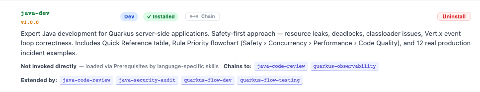
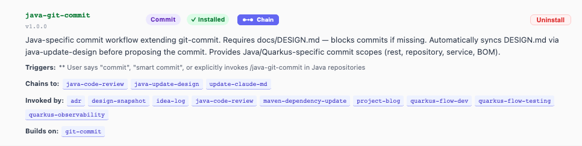
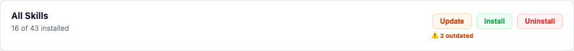
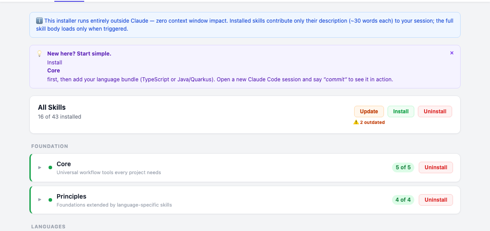
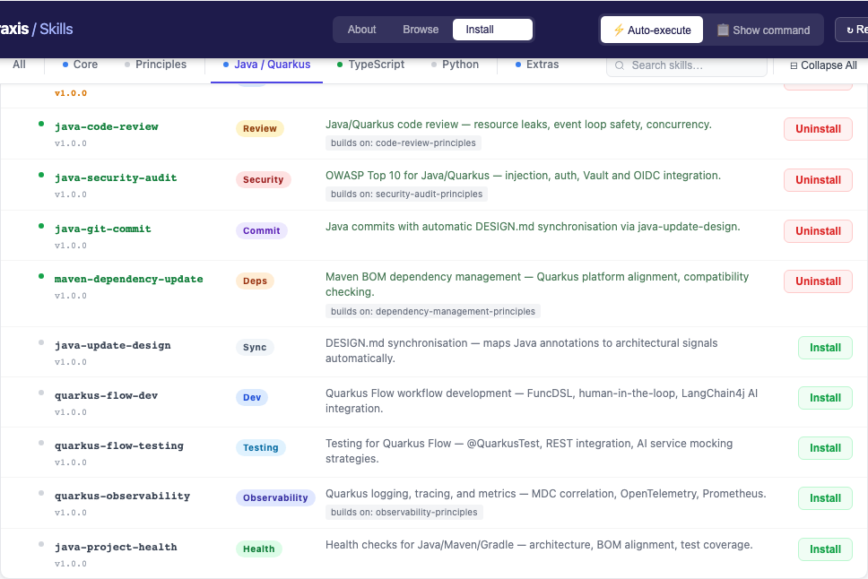
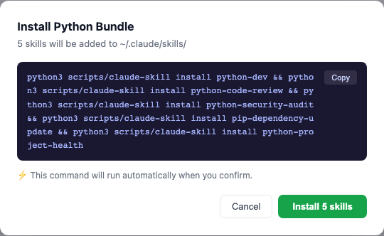
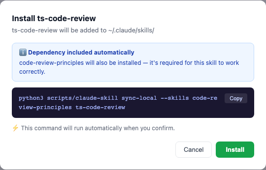
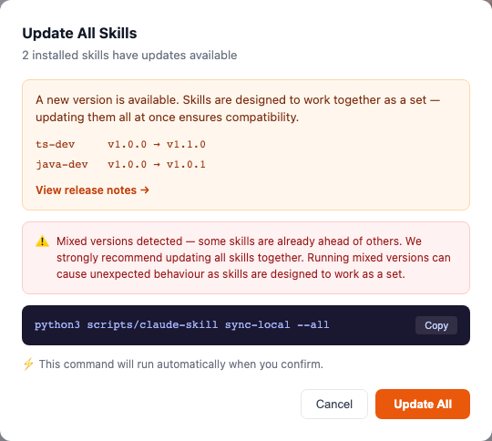
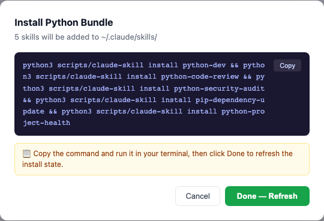
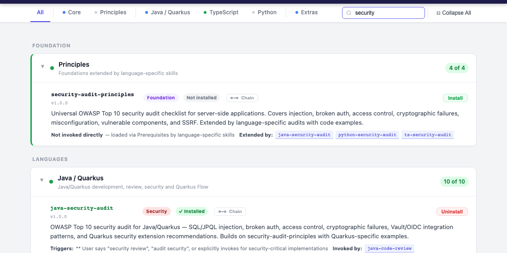

# cc-praxis Skill Manager — User Guide

The skill manager is a web interface for browsing, installing, and managing cc-praxis skills. It gives you a visual overview of all 43 skills, shows what's installed on your machine, and lets you install or remove skills with one click.

---

## Opening the Skill Manager

The skill manager has two modes depending on how you open it.

### Option A — Ask Claude to launch it

In any Claude Code session:

> "Open cc-praxis" or "launch the skill manager"

Claude will start the local server and open your browser automatically.

### Option B — Run it yourself

```bash
python3 scripts/web_installer.py
```

Or, if you installed the plugin and `cc-praxis` is on your PATH:

```bash
cc-praxis
```

This opens `http://localhost:8765` in your browser.

### Viewing on GitHub Pages (Browse only)

If you visit the skill manager on GitHub Pages rather than running it locally, the **Install** tab is hidden. You can browse all the skills and explore the chain graph, but installing requires running the local server — only the local server can read your `~/.claude/skills/` directory and run install commands on your machine.

---

## The Three Tabs


When you're on the Install tab, the header also shows the execution mode controls on the right:


| Tab | Purpose |
|-----|---------|
| **About** | Overview of the collection — what it does, how skills work, which languages are supported |
| **Browse** | Explore all 43 skills with descriptions and the skill chain graph |
| **Install** | See what's installed on your machine and manage your installation |

---

## Browse — Exploring Skills

The sticky navigation bar lets you jump to any bundle or search across all skills:


The Browse tab shows all skills grouped into bundles. Click a bundle header to expand it and see the individual skill cards.

### Skill Cards

Each skill card shows everything you need to understand a skill at a glance:



The card contains:

- **Name and version** — the skill identifier and release version
- **Role pill** — colour-coded badge indicating the skill's function  
- **Install status** — ✓ Installed (green) or Not installed (gray)
- **Description** — what the skill does and when it activates
- **Chaining relationships** — which skills this one connects to (see [The Chain Graph](#the-chain-graph) below)
- **Chain button** — opens the interactive dependency graph
- **Install / Uninstall** — quick action button for this skill

### Role Pills

The coloured badge tells you what category a skill belongs to:

| Pill | Category |
|------|---------|
| `Dev` (blue) | Development workflow |
| `Review` (amber) | Code review |
| `Security` (red) | Security audit |
| `Commit` (purple) | Git commit workflow |
| `Sync` (slate) | Document synchronisation |
| `Deps` (orange) | Dependency management |
| `Health` (green) | Project health checks |
| `Setup` (gray) | Installation wizards |
| `ADR` (slate) | Architecture documentation |
| `Foundation` (purple) | Universal base skills (not invoked directly) |

---

## Understanding Skill Relationships

Skills in cc-praxis form a connected system, not a collection of independent tools. There are three kinds of relationships.

### Chains To

When a skill finishes its job, it can hand off to another skill automatically. "Chains to" means: this skill will *offer* to invoke that one when the right conditions arise. You're always in control — chains are offers, not forced sequences.

**Example:** `java-code-review` chains to `java-security-audit` when it detects auth, payment, or PII code. You decide whether to run the security audit.

### Invoked By

The reverse of "chains to." This shows which skills lead to this one. Useful for understanding the full context in which a skill activates.

**Example:** `update-claude-md` is invoked by `git-commit`, `java-git-commit`, `blog-git-commit`, and `custom-git-commit` — every commit type offers it.

### Builds On / Extended By

Some skills are built on top of foundation skills. The foundation provides universal rules; the specialist adds language-specific depth.

```
code-review-principles  ◀── extended by ── java-code-review
                        ◀── extended by ── ts-code-review  
                        ◀── extended by ── python-code-review
```

`code-review-principles` is never invoked directly — it's a foundation loaded automatically when a specialist loads. When you install `java-code-review`, the skill manager detects this and includes `code-review-principles` in the install.

> **Built-on parents are always installed with their children.** You never need to install foundation skills separately.

---

## The Chain Graph

Every skill card has a **Chain** button. Clicking it opens an inline panel directly below (or above if you're near the bottom of the viewport) showing that skill's position in the full dependency graph.

Here's the chain graph for `java-git-commit` — a skill partway through a chain:



Reading the chain left to right:

- **⊙** — marks the root of the chain (a skill with no parent)
- **Ancestor names** — skills that lead to the one you clicked, ordered from root to direct parent
- **Current skill** (bold) — the skill whose card you opened
- **`▼` children** — skills this one chains to, shown as a vertical list on the right

Compare with `git-commit` itself — a root skill that has no ancestors:


Root skills have no `⊙` and no ancestors — they start the chain. Their panel shows only children.

### Navigating the Graph

Any skill name in the chain panel is **clickable**. Clicking scrolls to that skill's card and opens its own chain view. This lets you walk the full graph interactively:

- Click an ancestor to see how *that* skill connects upstream
- Click a child to explore what it leads to next
- Click **×** to close the panel

### Expanding Grandchildren

Children that have their own children show a `▶` toggle. Click it to expand or collapse grandchildren inline, without opening a new panel.

---

## Install — Managing Your Installation

The Install tab shows your real install state, read directly from `~/.claude/skills/` every time you open it.

### The Sync Bar

At the top of the Install tab, the sync bar gives you an at-a-glance summary:



- **X of 43 installed** — how many skills are in `~/.claude/skills/`
- **⚠️ N outdated** — skills where your version is behind the latest release (only shown when applicable)
- **Update** — updates all installed skills to the latest versions
- **Install** — installs all skills you don't have yet
- **Uninstall** — removes all installed skills

### Bundle States

Skills are organised into bundles. The collapsed bundle view shows install state for each at a glance:



| Indicator | Meaning |
|-----------|---------|
| **Green dot ●** | All skills in this bundle are installed |
| **Blue dot ◐** | Some installed, some not — partial bundle |
| **Gray dot ○** | No skills installed |

The count ("3 of 10") shows exactly how many are present. Partial bundles show both **Install** (for missing skills) and **Uninstall** (for installed ones).

### Individual Skill Rows

Expand a bundle to see each skill:



Each row shows:
- **●** or **○** dot — installed or not
- Skill name and version (amber if outdated)
- Role pill
- Short description
- **Install** or **Uninstall** button for that skill alone

---

## Installing Skills

### Installing a Bundle

Click **Install** on a bundle header. If some skills in that bundle are already installed, the modal shows only the ones that still need installing — it never tries to reinstall what you already have:



### Installing an Individual Skill with a Dependency

When you install a skill that builds on a foundation, the skill manager automatically includes the foundation in the install. You'll see a blue information box explaining this:



> **You never need to install foundation skills manually.** Just install the skill you want; the manager handles the rest.

---

## Update — Moving Everything to One Version

The **Update** button is different from **Install**:

| Action | What it does |
|--------|-------------|
| **Install** | Adds skills not yet installed |
| **Uninstall** | Removes installed skills |
| **Update** | Brings *all installed* skills to their latest version |

Skills in cc-praxis are designed to work together as a consistent set. The update modal shows exactly what will change and links to the release notes:



> **Why update as a set?** `java-code-review` references conventions defined in `java-dev`. `git-commit` routes to specialists that share the same commit format. Running different versions of related skills can cause subtle inconsistencies. The update modal will warn you if mixed versions are detected.

---

## Auto Execute vs Show Command

The mode toggle in the Install tab header controls what happens when you confirm an action:


### ⚡ Auto Execute (default)

The skill manager runs the command for you. Confirm the install, it runs in the background, and you see a success banner that stays visible until you dismiss it.

### 📋 Show Command

The modal shows the command but doesn't run it. Copy it and run it yourself in your terminal:



After running the command manually, click **Done — Refresh**. This tells the skill manager to reload install state from `~/.claude/skills/` and update all the dots and counts.

> Use **Show Command** if you want to review what will run before it happens, or if you prefer keeping shell commands in your own terminal.

---

## Refreshing the Install State

The install state loads when the page opens and refreshes automatically after every Auto Execute action. If you install or remove skills in your terminal directly, click **↻ Refresh** in the header to reload from disk.

---

## Finding Skills

Type in the search box in the navigation bar to filter skills across both Browse and Install views:



Results filter instantly as you type — matching on skill name or description. Bundles with no matches are hidden; bundles with matches auto-expand.

Use **⊟ Collapse All** / **⊞ Expand All** to control bundle visibility.

---

## Recommended Installation Order

If you're starting fresh:

**1. Core** — works in every project (git-commit, update-claude-md, adr, project-health, project-refine)

**2. Principles** — foundations that language bundles build on (code-review-principles, security-audit-principles, dependency-management-principles, observability-principles)

**3. Your language bundle** — Java/Quarkus, TypeScript, or Python (or all three)

**4. Extras** as needed — issue-workflow, design-snapshot, idea-log, project-blog, knowledge-garden

The nudge at the top of the Install tab reminds you of this when you first open it.

---

## After Installing

**Open a new Claude Code session** for changes to take effect. Skills load at session start — existing sessions don't pick up new skills until restarted.

---

## Quick Reference

| What you want | Where |
|--------------|-------|
| What a skill does | Browse → skill card description |
| How skills connect | Browse → Chain button on any card |
| What's installed | Install → dots and counts |
| Install a bundle | Install → Install button on bundle header |
| Install one skill | Install → Install button on skill row |
| Update outdated skills | Install → Update in sync bar |
| Remove skills | Install → Uninstall on bundle or row |
| Run command yourself | Switch to Show Command mode |
| Refresh after terminal install | ↻ Refresh in header |
| Find a skill | Search bar in navigation |
| Open the manager | `python3 scripts/web_installer.py` or ask Claude |
