# Session Handover

> **Terminology:** *handover* is the act (what you do at session end); *handoff* is the artifact (the `HANDOFF.md` file passed to the next session).

## When to Use This vs work-end

| Situation | Skill |
|-----------|-------|
| Branch is **done** — closing, merging, pushing | `work-end` (includes full wrap + HANDOFF.md) |
| Branch is **not done** — pausing mid-work, ending session | `handover` (this skill) |
| **Resuming** from a previous session | `resume handover` (this skill, resume path) |

**work-end already writes HANDOFF.md** as its final step (Step 12). If you just ran
work-end, do NOT invoke this skill — everything is already done.

---

## Resuming a Handover

When the user says "resume handover" (or similar), the job is to **locate and read** HANDOFF.md, not create one.

**HANDOFF.md lives in the workspace, not the project repo.** Many projects separate methodology artifacts (handovers, blog, specs, ADRs) into a dedicated workspace repository. Always resolve the correct location before reading.

### Step R1 — Determine where HANDOFF.md lives

Use the same convention as `work-start` — derive workspace from CWD via git, not from CLAUDE.md:

Run the bundled context script — no shell variable assignments:
```bash
python3 ~/.claude/skills/project-init/ctx.py
```

Use `WORKSPACE` and `PROJECT` from the output as concrete strings. HANDOFF.md is at `<WORKSPACE>/HANDOFF.md`.

**Do not scan CLAUDE.md for a workspace path.** Multiple CLAUDE.mds are loaded per session (global, parent, project). The parent's `**Workspace:**` declaration will be found first and will point to the wrong repo. `python3 ~/.claude/skills/project-init/ctx.py` resolves from CWD via git — always correct.

### Step R2 — Check freshness, then read

```bash
git -C "$WORKSPACE" log -1 --format="%ar" -- HANDOFF.md
```

If more than a week old, flag it before using the context:
> "HANDOFF.md is N days old — some context may be stale. Verify key assumptions before building on it."

Read the file, then immediately proceed to Step R2b.

### Step R2b — Detect open branch (continue-in-place)

Check whether the previous session left an open branch (mid-work handover, not work-end):

```bash
cat "$WORKSPACE/design/.meta" 2>/dev/null
```

If `.meta` exists on the current branch AND `$WORKSPACE/design/EPIC-CLOSED.md` does NOT exist
on that branch → the previous session paused mid-work. The branch is still open.

**If open branch detected:** present the resume output (Steps R3+) with this Immediate
Next Step:

> "Branch `<branch-name>` is still open for #`<issue>`. Run `/work` to continue."

`work-start` will detect the existing `.meta` and resume the branch (Detection state 2).
Do not start a new branch or suggest picking different work.

**If no `.meta` or EPIC-CLOSED.md exists:** the previous session closed cleanly via work-end.
Proceed normally — the Immediate Next Step comes from HANDOFF.md content.

### Step R3 — GitHub issue cross-check (always runs)

Runs automatically after reading HANDOFF.md.

**If `OWNER_REPO` is empty (no GitHub repo configured):** skip silently — no prompt.

**Otherwise:**

Scan HANDOFF.md for `#N` patterns in What's Left and What's Next sections. Deduplicate.

Use `OWNER_REPO` from the ctx.py output. If empty, skip silently.

For each `#N` found, run a separate command per issue with the concrete repo value:
```bash
gh issue view <N> --repo <OWNER_REPO> --json state,title --jq '"#\(.number) [\(.state)] \(.title)"' 2>/dev/null
```

If any are CLOSED but still appear as open work: remove them from HANDOFF.md immediately — no prompt. Add `*Updated: #N, #M closed — removed from backlog.*` at the top, commit to workspace main.

Report what was removed at the end of the resume output (see structure below).

Then read the file and present the resume output using this structure:

---

**## Last Session**
2–3 lines: what was done and the key outcome.

**## Immediate Next Step**
Single specific action right now — procedural or unblocking (e.g. "run /work", "delete branches", "fix X in Y").

**## Cross-Module**
Only include if HANDOFF.md contains cross-module dependencies. Omit the section entirely if there are none.

**We're blocking** (other modules waiting on us — treat as high priority):
- `<module>` — what they need from us · Scale · Complexity

**Blocked by** (can't proceed until):
- `<module>` — what we need from them (gates #N) · Scale · Complexity

**## What's Left**
Trailing obligations from current/recent work — in-flight, filed, or owed. Each item carries tags. Omit if none.
- `<description>` · Scale · Complexity

**## What's Next**
Discretionary new work. Items blocked by other modules are flagged in Notes.

| # | Description | Scale | Complexity | Notes |
|---|-------------|-------|------------|-------|
| #N | ... | S | Low | ... |

**## Cleaned up**
Only include if issues were removed during cross-check. Omit entirely if nothing was removed.
- `#N — <title>` — closed, removed from backlog

---

**Tag definitions (infer from issue description, HANDOFF.md context, and any referenced specs):**
- **Scale**: XS (lines) / S (single class) / M (multi-class) / L (substantial feature) / XL (major rework)
- **Complexity**: Low (clear path, no unknowns) / Med (some design or unknowns) / High (significant unknowns, design required)

Be directionally honest — don't inflate Complexity to seem thorough.

### Common Mistake

Do **not** scan CLAUDE.md for a workspace path. Multiple CLAUDE.mds are loaded (global, parent, project-level), and a parent repo's `**Workspace:**` declaration will be picked up instead of the current session's workspace. Always use `git rev-parse --show-toplevel` from CWD — that is the workspace.

---

Generates a concise `HANDOFF.md` — a pointer document that gives the next
Claude session enough context to resume immediately. References are read on
demand; the handover itself stays small. Git history is the archive.

**Token budget:** HANDOFF.md should be readable in under 500 tokens. If it's
longer, trim — it has become a document, not a handover.

---

## What This Is Not

- **Not a project blog entry** — the blog captures narrative for posterity.
  The handover captures operational context for the next 24–48 hours.
- **Not a knowledge-garden entry** — cross-project technical gotchas go in
  the garden. Session-specific context goes in the handover.
- **Not a replacement for CLAUDE.md** — CLAUDE.md is already auto-loaded
  and covers permanent conventions. Don't duplicate it here.

---

## Core Principles

### 1. Write only deltas — reference the rest

If something hasn't changed since the previous handover, **don't restate it**.
Write `*Unchanged — retrieve with: `git show HEAD~1:HANDOFF.md`*` for that
section and move on. Only sections that actually changed get written in full.

This keeps the current handover minimal. The git history holds everything else.

### 2. Git history is the archive

HANDOFF.md is a single file, overwritten each session and **always committed**.
Previous versions are free — they live in git. No separate archive directory
needed.

```bash
# How many handovers exist?
git log --oneline -- HANDOFF.md

# When was the last one written?
git log -1 --format="%ar" -- HANDOFF.md

# Read the previous handover (whole file)
git show HEAD~1:HANDOFF.md

# What changed between the last two handovers?
git diff HEAD~1 HEAD -- HANDOFF.md

# Read just one section of a previous handover (surgical)
git show HEAD~1:HANDOFF.md | grep -A 10 "## Open Questions"

# Find a handover from a specific date
git log --before="2026-04-03" -1 --format="%H" -- HANDOFF.md | xargs -I{} git show {}:HANDOFF.md
```

These commands are cheap — use them rather than loading full files when only
part of the historical context is needed.

### 3. Commit is required, not optional

An uncommitted HANDOFF.md is invisible to git history — the archive doesn't
exist. Always commit. No exceptions.

### 4. Freshness check before reading

When starting a session, check how old the handover is before loading it:

```bash
git log -1 --format="%ar" -- HANDOFF.md   # → "3 days ago"
```

If it's more than a week old, flag it before using the context:
> "HANDOFF.md is 9 days old — some context may be stale. Verify key
> assumptions before building on it."

The next session can then choose to load a more recent intermediate handover
from git history if one exists.

### 5. Read nothing just to reference it

If a file is already in context from this session, summarise from memory.
If it isn't, write the path — the next session reads it only if the task
requires it. This is the knowledge-garden GARDEN.md approach applied to
session continuity.

---

## Workflow

### Step 0 — Session wrap checklist

Before writing the handover, offer to create the supporting artifacts.
Present this exactly:

```
Session wrap — create before writing the handover?

[x] 1  write-content    capture this session's work as a diary entry
[x] 2  update-claude-md  sync any new workflow conventions
[x] 3  forage sweep      check for gotchas, techniques, undocumented
[x] 4  protocol sweep    check for project rules worth formalising
[?] 5  journal-entry     document any design changes this session not yet in design/JOURNAL.md  ← ON if mid-epic (design/.meta exists), OFF otherwise
[?] 6  epic hygiene      check epic branch state, alignment, and staleness  ← ON if workspace configured, OFF otherwise
[?] 7  arc42 stale scan  check ARC42STORIES.MD for stale statuses, resolved blockers, closed-issue forward refs  ← ON if ARC42STORIES.MD exists

Type numbers to toggle (e.g. "2 6"), "all" to toggle all on/off, or "go" to proceed:
```

- **Default:** write-content (diary), update-claude-md, forage sweep, protocol sweep ticked; journal-entry depends on epic state (see below).
- **protocol sweep is on by default** — scans the session for project-specific rules worth formalising. Skip it for sessions that worked purely in universal tools with no project-specific rules established or re-enforced. The protocol skill creates `docs/protocols/` if it does not exist — never skip the sweep because the directory is absent.
- **journal-entry is ON by default when on an epic branch** — check `ls design/.meta 2>/dev/null` before showing the checklist. If `.meta` exists the session is mid-epic and design reasoning is about to be lost; default journal-entry to ON. If not on an epic branch, default to OFF.
- **epic hygiene is ON by default when a workspace is configured** — check `**Workspace:**` in CLAUDE.md. Runs these checks and surfaces any issues before the session ends:
  1. Orphaned `.meta` on main (epic closed without cleanup)
  2. Workspace/project branch misalignment
  3. Open epic branches with no commits in the last 7 days (stale)
  4. Mid-epic: journal exists but has no `§Section` anchors (entries will not merge at close)
  5. **Project main working tree dirty** — run `git status --short` on the project base branch; any staged or unstaged changes mean an operation was left incomplete
  6. **Project main diverged from remote** — run `git log origin/main..main --oneline` and `git log main..origin/main --oneline`; local commits not on remote = work invisible to next session; remote ahead of local = next session will conflict
  Report findings — do not auto-fix, just surface them so they can be addressed or noted in the handover.
- **arc42 stale scan is ON by default when ARC42STORIES.MD exists** — check `[ -f "$PROJECT/ARC42STORIES.MD" ]`. Catches stale status drift that accumulates from cross-session and cross-repo work — the three failure modes it targets are: (a) layer/chapter status not updated when the issue closed in a different session, (b) external blocker references (cross-repo issues, foundation PRs) that shipped but were never cleared, (c) forward-tense issue references ("will migrate", "#N will...") where the referenced issue is now CLOSED. Run after epic hygiene so any just-surfaced issues are also reflected. See **Step 2c — ARC42STORIES.MD stale scan** below.
- **"all":** if all are on → turn all off; if any are off → turn all on
- **Numbers:** toggle individual items
- **"go" (or "ok", "yes", blank Enter if the UI allows it):** proceed with current selections

Run checked items **in this order** before continuing:
1. Epic hygiene — run first so any issues surface early and can be mentioned in blog/handover
2. Forage sweep — done while context is full (findings may feed the blog)
3. Protocol sweep — done while context is full; catches project-specific rules before context is lost
4. update-claude-md — sync new conventions first
5. journal-entry — write any missing JOURNAL.md entries before the handover
6. arc42 stale scan — run after journal-entry so any layer completions just written are already reflected
7. write-content (diary) — written last so it can mention forage and protocol submissions and synthesise the complete session narrative including any new conventions

After all checked items complete, continue to Step 1.

---

### Step 1 — Check previous handover (cheap)

```bash
git log --oneline -3 -- HANDOFF.md
```

If a previous handover exists, get the diff to know what changed:

```bash
git diff HEAD -- HANDOFF.md 2>/dev/null || git show HEAD:HANDOFF.md 2>/dev/null
```

This tells you what sections are unchanged — don't rewrite those. Work from
the diff, not from loading the full previous file.

### Step 2 — Recall from context (free)

From the current session, recall:
- What changed from the last handover? (only write these)
- What decisions were made? What was tried and didn't work?
- What cross-module dependencies exist? Are we blocking any other module? Is anything blocking us?
- What's trailing from this session that feels owed (What's Left)?
- What new discrete work could be picked up next (What's Next)?
- What's the single most important next action (Immediate Next Step)?

Do NOT read any project files to answer these. Work from conversation memory.

### Step 2b — Forage sweep (while context is still full)

**The sweep is done by the handover itself from conversation memory** —
not by invoking forage and asking it to find things. Forage
is only called once specific entries have been identified.

Review the session across all three categories. For each one, think
through what actually happened in the conversation:

**Gotchas** — did anything go wrong in a non-obvious way?
> Scan for: bugs whose symptom misled about root cause; silent failures
> with no error; things that required multiple failed approaches; workarounds
> for things that "should" work but don't.

**Techniques** — did any non-obvious approach work well?
> Scan for: solutions a skilled developer wouldn't naturally reach for;
> tool or API combinations used in undocumented ways; patterns that solved
> a problem more elegantly than expected.

**Undocumented** — was anything discovered that isn't in the official docs?
> Scan for: flags, options, or behaviours only findable via source code;
> features that work but have no documentation; things discovered through
> trial and error or commit history.

For each finding, **propose it explicitly** before proceeding:

> "During this session we hit X — [brief description]. Worth submitting
> to the garden as a [gotcha / technique / undocumented]?"

If confirmed → invoke `forage` CAPTURE with the specific content already
known from context. Do NOT invoke forage and ask it to find things.

If nothing surfaces in any category → proceed to Step 3.

> **Why here:** The context window is full. After the handover is written
> and the session ends, this knowledge is lost. The sweep costs near-zero
> from context; the cost of missing an entry is rediscovery time later.

The sweep is **always done** (even if it finds nothing). Completeness
matters — checking all three categories explicitly prevents the common
failure of only catching the most obvious kind (usually gotchas) and
missing techniques and undocumented items.

### Step 2c — ARC42STORIES.MD stale scan (if checked)

Only run if `ARC42STORIES.MD` exists in the project repo and was ticked in the checklist. The goal is to catch drift that accumulates across sessions, particularly from cross-repo work — when a foundation module ships or an issue closes in a different session, the references in ARC42STORIES.MD are not automatically updated.

**Three things to scan for:**

**1. Layer/chapter statuses not reflecting closed issues**

Read the layer taxonomy table (§4) and chapter index (§9.2). For each row that shows `🔲 pending (#NNN)`, check the referenced issue:
```bash
gh issue view <NNN> --repo <OWNER_REPO> --json state --jq '.state'
```
If the issue is CLOSED but the row still says pending, the status is stale.

**2. External blocker references that have resolved**

Scan ARC42STORIES.MD for phrases like `blocked on`, `pending casehubio/`, `waiting on`, `requires`, followed by an external issue reference (e.g. `casehubio/ledger#114`). For each cross-repo reference found:
```bash
gh issue view NNN --repo "casehubio/REPO" --json state --jq '.state'
```
If the blocker issue is CLOSED, the "blocked on" language is stale.

**3. Forward-tense issue references where the issue is now closed**

Scan for phrases like `#NNN will`, `will migrate`, `will add`, `will replace` followed by or preceded by a `#NNN` issue reference. For each one, check if that issue is now CLOSED. If so, the sentence should be updated to past tense.

**Report and offer to fix:**

Present each finding with the exact line and proposed fix. Apply only on confirmation. After applying fixes, commit to the project repo:
```bash
git -C "$PROJECT" add ARC42STORIES.MD
git -C "$PROJECT" commit -m "docs: sync ARC42STORIES.MD — stale scan at session wrap"
```

**If nothing stale is found**, proceed silently.

**Why this belongs in wrap, not work-end:** Work-end covers only what changed *this session*. ARC42STORIES.MD staleness accumulates from cross-session and cross-repo work — foundation modules shipping, issues closing in different sessions — so it requires a periodic point-in-time scan, not a per-commit update.

### Step 3 — Gather cheap orientation

```bash
git log --oneline -6        # recent commits
git status --short          # any uncommitted state
```

### Step 4 — Build the references table (locate, don't read)

```bash
ls snapshots/ | sort | tail -1   # latest snapshot path
ls blog/ | sort | tail -1        # latest blog entry path
ls adr/ | sort | tail -3         # recent ADRs
```

Run `ls` only — do not open the files. CLAUDE.md is auto-loaded; omit it.

### Step 5 — Write HANDOFF.md (delta-first)

Use the template and routing table in [handover-reference.md](handover-reference.md).

For each section: has it changed since last handover?
- **Changed** → write it in full
- **Unchanged** → write `*Unchanged — `git show HEAD~1:HANDOFF.md`*`
- **Doesn't exist yet** (first handover) → write all sections in full

Overwrite the previous HANDOFF.md completely.

### Step 5a — Content boundary check

Before proceeding, scan the draft for content that doesn't belong in a
technical record by default — personal characterisations, social context,
meeting dynamics, or anything a third party would be surprised to read.

**Note:** if the author explicitly asked for any of this to be included, it
belongs and does not need flagging. This check catches accidental inclusion,
not deliberate author choices.

Ask yourself: *Does this handover contain anything a colleague, stakeholder,
or future reader would find surprising, uncomfortable, or out of place in a
technical document?*

Flags to look for:

- What a specific person said, thought, or decided in a meeting
- Characterisation of anyone's personality, competence, or approach
- Frustration or complaints directed at a person or team
- Social or organisational dynamics around a decision
- Anything that reads as gossip, venting, or interpersonal commentary

**If anything is flagged**, present it to the author:

```
⚠️  Content boundary check — author decision required:

Sentence: "<exact sentence>"
Concern: <one-line reason>

Options:
  [K] Keep as written
  [R] Rephrase — describe what to change
  [D] Delete this sentence
```

Wait for a decision on each. Apply all decisions before continuing.

**If nothing is flagged** → proceed silently to Step 5b.

### Step 5b — Suggest and offer to rename the session

**Only prompt if the session has an auto-generated name.** Auto-generated names
follow a random three-word pattern (e.g. `gleaming-stargazing-newell`,
`mellow-hopping-simon`). If the session already has a meaningful custom name
(set by the user earlier in the session) → skip this step silently.

If the session name appears auto-generated, generate a concise descriptive name
from the session's content — 2–4 words, e.g. "Hortora Design and Naming" or
"Garden v2 Retrieval Redesign." — and suggest it **after the handover is written
and committed**:

> **Rename this session?**
>
> Suggested name: **`<Suggested Name>`**
>
> Type `/rename <Suggested Name>` to apply it.

**Note:** Do not block writing or committing the handover on the rename.
The rename is cosmetic — the handover must be committed regardless.
`/rename` is a Claude Code built-in; the user must type it.

### Step 6 — Commit (required)

Resolve the workspace path via the context script (already run in Path Resolution above), then commit. HANDOFF.md must **always** be committed to workspace **main**, even when the session is on a branch. It is a session artifact, not a branch artifact — committing it to a branch makes it invisible to the next session starting on main.

Use `WORKSPACE` from the ctx.py output as a concrete string.

```bash
CURRENT_BRANCH=$(git -C <Workspace> branch --show-current)

# If on an epic branch, switch workspace to main, commit, switch back
if [ "$CURRENT_BRANCH" != "main" ]; then
  git -C <Workspace> stash
  git -C <Workspace> checkout main
  git -C <Workspace> pull --rebase origin main
  git -C <Workspace> add HANDOFF.md
  git -C <Workspace> commit -m "docs: session handover YYYY-MM-DD"
  git -C <Workspace> push
  git -C <Workspace> checkout "$CURRENT_BRANCH"
  git -C <Workspace> stash pop
else
  git -C <Workspace> pull --rebase origin main
  git -C <Workspace> add HANDOFF.md
  git -C <Workspace> commit -m "docs: session handover YYYY-MM-DD"
  git -C <Workspace> push
fi
```

Committing is mandatory. It's what makes git history the archive.

### Step 7 — Session close summary

After the commit, output a single tick-list summary showing what was done and what was skipped. This gives the user a clean signal that the wrap is complete and nothing was missed.

```
Session wrap complete.

✅ Epic hygiene          (or ⏭ skipped — [reason])
✅ Forage sweep          N entries submitted  (or: nothing garden-worthy found)
✅ Protocol sweep        N protocols captured (or: nothing new)
✅ update-claude-md      (or ⏭ skipped)
✅ journal-entry         (or ⏭ skipped — not mid-epic)
✅ arc42 stale scan      N items fixed  (or: nothing stale found)  (or ⏭ skipped — no ARC42STORIES.MD)
✅ write-content (diary)  <entry filename>
✅ HANDOFF.md committed  <workspace>/HANDOFF.md → main
```

Rules:
- Show every checklist item — both ticked and skipped
- For skipped items, include a brief reason in parentheses
- For forage sweep, show the count of entries submitted (or "nothing garden-worthy found" if the sweep was clean)
- For arc42 stale scan, show how many items were fixed (or "nothing stale found")
- For write-content (diary), show the actual filename written
- For HANDOFF.md, show the resolved workspace path
- Keep each line to one line — no multi-line elaboration

---

---

## Decision Flow

```mermaid
flowchart TD
    Trigger((Session ending))
    WrapChecklist[Show wrap checklist:\nwrite-content / update-claude-md /\nforage sweep / protocol sweep /\njournal-entry\nmost on by default]
    UserToggles[User toggles items\nor types 'all' / Enter]
    GardenSweep[Forage sweep if checked:\ncheck gotchas / techniques /\nundocumented — all 3 categories]
    GardenFound{Anything\nworth submitting?}
    SubmitGarden[Invoke forage CAPTURE\nto write submission]
    WriteBlog[Invoke write-content\nsingle-entry for this session]
    UpdateClaude[Invoke update-claude-md\nsync new conventions]
    CheckHistory[git log --oneline -3\n-- HANDOFF.md]
    HasPrevious{Previous\nhandover exists?}
    GetDiff[git diff HEAD -- HANDOFF.md\nidentify unchanged sections]
    Recall[Recall from context:\nwhat changed, decisions,\nnext step — zero cost]
    GitStatus[git log --oneline -6\ngit status --short]
    BuildRefs[ls to locate file paths\ndo not open files]
    Draft[Write HANDOFF.md:\nchanged sections in full,\nunchanged sections as references]
    TokenCheck{Over 500 tokens?}
    Trim[Mark more sections\nas unchanged references]
    Confirm[Show to user]
    UserApproves{Approved?}
    Refine[Adjust]
    Write[Write HANDOFF.md]
    Commit[git add HANDOFF.md\ngit commit — required]
    Done((Done))

    Trigger --> WrapChecklist
    WrapChecklist --> UserToggles
    UserToggles --> GardenSweep
    GardenSweep --> GardenFound
    GardenFound -->|yes| SubmitGarden
    GardenFound -->|no| UpdateClaude
    SubmitGarden --> UpdateClaude
    UpdateClaude --> WriteBlog
    WriteBlog --> CheckHistory
    CheckHistory --> HasPrevious
    HasPrevious -->|yes| GetDiff
    HasPrevious -->|no| Recall
    GetDiff --> Recall
    Recall --> GitStatus
    GitStatus --> BuildRefs
    BuildRefs --> Draft
    Draft --> TokenCheck
    TokenCheck -->|yes| Trim
    Trim --> Draft
    TokenCheck -->|no| Confirm
    Confirm --> UserApproves
    UserApproves -->|yes| Write
    UserApproves -->|adjust| Refine
    Refine --> Draft
    Write --> Commit
    Commit --> Done
```



---

## Common Pitfalls

| Mistake | Why It's Wrong | Fix |
|---------|----------------|-----|
| Restating unchanged context verbatim | Wastes tokens; the previous handover already has it | Write `*Unchanged — git show HEAD~1:HANDOFF.md*` |
| Skipping the commit | Makes git history useless as an archive | Commit is mandatory, not optional |
| Loading previous handover to check what's unchanged | Wastes tokens; use `git diff` instead | `git diff HEAD -- HANDOFF.md` shows only what changed |
| Loading GARDEN.md detail files | Index is enough; details load on demand | Always reference GARDEN.md (index), never sub-files |
| Copying CLAUDE.md content | Auto-loaded; pure duplication | Omit entirely |
| Skipping the freshness check | Old handover misleads the next session | `git log -1 --format="%ar" -- HANDOFF.md` before using |
| Writing "continue work" as next step | Too vague to act on | Be specific — name the file, command, or section |
| Scanning CLAUDE.md for workspace path when resuming | Multiple CLAUDE.mds are loaded; parent's `**Workspace:**` is found first and points to the wrong repo | Use `git rev-parse --show-toplevel` from CWD — that is always the workspace |

---

## Success Criteria

Handover is complete when:

- ✅ Wrap checklist shown and user selections confirmed
- ✅ Forage sweep performed — all three categories checked (gotchas, techniques, undocumented)
- ✅ Any garden-worthy entries submitted via forage CAPTURE before writing the handover
- ✅ Protocol sweep performed (if checked) — session scanned for project-specific rules worth formalising; confirmed entries captured and committed
- ✅ write-content (diary) invoked (if checked) — session diary entry written
- ✅ update-claude-md invoked (if checked) — CLAUDE.md synced
- ✅ journal-entry written (if checked) — design/JOURNAL.md updated; off by default; only applicable on epic branches
- ✅ Session name offered — user was prompted to `/rename` or acknowledged the session already has a meaningful name
- ✅ HANDOFF.md exists at project root
- ✅ Readable in under 500 tokens
- ✅ Unchanged sections reference git history, not repeated content
- ✅ Immediate next step is specific enough to act on without asking
- ✅ Cross-Module section present if deps exist; omitted entirely if none
- ✅ What's Left items carry Scale · Complexity tags
- ✅ What's Next table carries Scale / Complexity / Notes columns
- ✅ References table uses paths only — no file content inline
- ✅ Nothing from CLAUDE.md is duplicated
- ✅ arc42 stale scan performed (if ARC42STORIES.MD exists) — stale statuses, resolved blockers, and closed-issue forward refs checked and fixed
- ✅ User confirmed before writing
- ✅ Committed to git (required — this is the archive mechanism)

**The test:** Could a fresh Claude reading only CLAUDE.md and HANDOFF.md
pick up the work in the next message, with git history available for any
context marked as "unchanged"? If yes — done.

---

## Skill Chaining

**Invoked by:** User directly for mid-work session wrap ("create a handover",
"end of session", "write a handover", "wrap"). NOT invoked after work-end —
work-end Step 12 handles the full wrap including HANDOFF.md.

**Invokes:** [`forage`] — forage sweep (Step 2b); [`protocol`] — protocol sweep
(if checked); [`write-content`] — diary (if checked); [`update-claude-md`] —
convention sync (if checked); `git commit` directly for HANDOFF.md

**Resume path invokes:** [`work-start`] — when an open branch is detected,
the resume output directs the user to `/work` which handles branch resumption

**Reads from (surgical, not upfront):**
- `git diff HEAD -- HANDOFF.md` — what changed from last handover
- `git log --oneline -6` — recent commits for orientation
- `ls` on workspace directories — locate paths without reading files
- `design/.meta` + `design/EPIC-CLOSED.md` — open branch detection on resume

**Complements:**
- `work-end` — branch closure includes full wrap; this skill is for mid-work only
- `write-content` — narrative context the handover points to
- `forage` — technical gotcha index the handover references

**Does NOT replace:** CLAUDE.md (auto-loaded), `--resume`/`--continue` flags
(restore conversation history for same-machine continuation)
