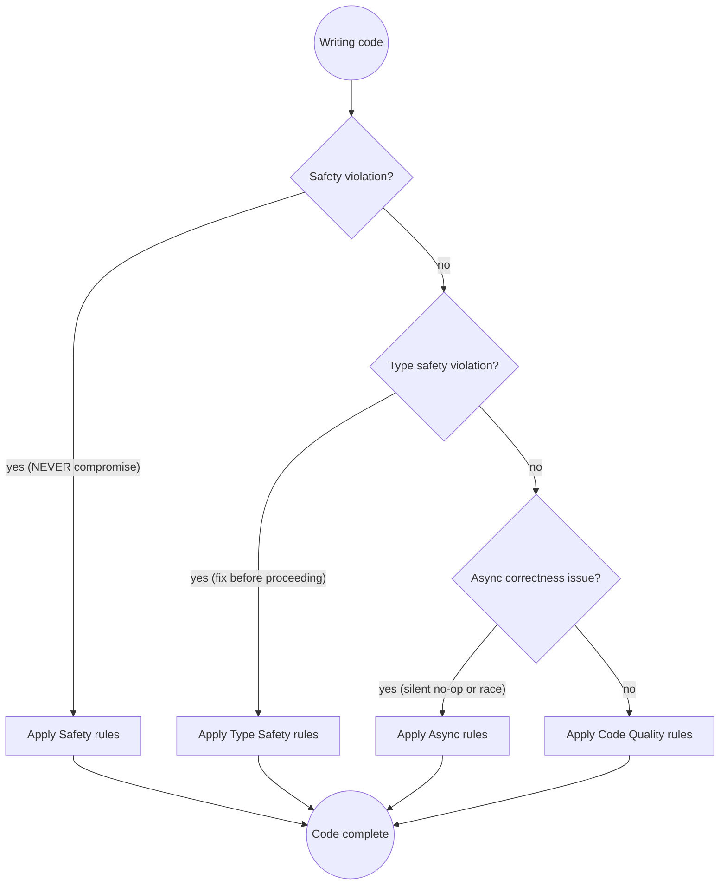

# Python Development

## Quick Reference

| Category | Rule | How to Apply |
|----------|------|--------------|
| **Safety** | Never use mutable default arguments | Use `None` as default; initialise inside the function body |
| | Always use context managers | `with` for files, DB connections, locks — no manual `close()` |
| | No bare `except:` | Catch specific exceptions; bare `except` swallows `KeyboardInterrupt` |
| | Never `eval()`/`exec()` on input | Code injection; use `ast.literal_eval` or structured parsers |
| | `pathlib.Path` over `os.path` | Cross-platform, composable, readable |
| **Type Safety** | Type-hint all function signatures | Enables mypy, IDE completion, and self-documenting APIs |
| | `Optional[X]` / `X \| None` for nullable | Caller must handle `None`; don't let it drift silently |
| | Avoid `Any` | Use `Union`, `TypeVar`, or `Protocol` to preserve type information |
| | `mypy --strict` in CI | Strict mode catches implicit `Any`, missing return types, untyped imports |
| | `@dataclass` / `TypedDict` for structured data | Named fields, type-checked, no raw `dict` guessing |
| **Async Patterns** | Always `await` coroutines | Unawaited coroutines are silent no-ops — no error, no execution |
| | `asyncio.gather()` for parallel work | Sequential `await` in a loop forfeits all concurrency benefits |
| | Never block the event loop | Use `run_in_executor` for CPU or blocking I/O |
| | `async with` for async context managers | Ensures `__aexit__` runs even on exceptions |
| | `asyncio.TaskGroup` (3.11+) | Structured concurrency; cancels siblings on first failure |
| **Testing** | pytest fixtures over `unittest` classes | Composable, reusable, cleaner setup/teardown |
| | `@pytest.mark.parametrize` for cases | Table-driven tests — less boilerplate, clearer intent |
| | Real implementations over mocks | Mocks drift from production; use them only for external I/O |
| | `tmp_path` fixture for file tests | Isolated temp directory per test; never hardcoded paths |
| **Code Quality** | `f-strings` over `.format()` / `%` | Readable inline, evaluated eagerly, not a template injection risk |
| | `typing.Final` for constants | Communicates intent; mypy rejects reassignment |
| | `__slots__` in hot classes | Reduces per-instance memory; prevents accidental attribute creation |
| | `dataclasses.dataclass` over manual `__init__` | Auto-generates `__repr__`, `__eq__`, optional `__hash__` |

## Rule Priority Decision Flow



**Priority order:** Safety > Type Safety > Async Correctness > Code Quality

## Why These Rules Matter

**Mutable default arguments causing shared state:** A function accumulated user-submitted tags across requests because its default `list` was shared across all calls. The bug only appeared under load, when multiple users hit the endpoint simultaneously. Fix: `def add_tag(tag, tags=None): tags = tags or []`.

**Missing type hints causing AttributeErrors in production:** An internal API changed a field from `user_id: str` to `user: dict`. The callers — all untyped — accessed `.user_id` directly on the response. mypy with type hints would have caught every affected call site at CI time. Fix: typed function signatures + `mypy --strict` in CI.

**Bare `except` swallowing `KeyboardInterrupt`:** A long-running batch job wrapped its retry loop in `except:`. A developer tried to stop the job with Ctrl-C; the process ignored the signal and continued running. `KeyboardInterrupt` and `SystemExit` are not subclasses of `Exception` — a bare `except:` catches everything, including signals Python uses internally. Fix: `except Exception:` at minimum; `except (ValueError, IOError):` when the error type is known.

**Late-binding closures in loops:** A list of callback functions was built in a loop: `actions = [lambda: print(i) for i in range(5)]`. All five lambdas printed `4` because `i` was looked up at call time, not capture time. Fix: `lambda i=i: print(i)` to bind the value, or replace with a named function.

These are real incidents. The rules exist because the pain is real.

## Safety

Python's dynamism makes safety issues silent — there's no compiler to catch them. These rules prevent the most common runtime surprises.

**Never use mutable default arguments — they are shared across all calls:**
```python
# ❌ BAD: The list is created once and shared; tags accumulate across calls
def add_tag(tag: str, tags: list[str] = []) -> list[str]:
    tags.append(tag)
    return tags

add_tag("a")  # ["a"]
add_tag("b")  # ["a", "b"] — not ["b"]!

# ✅ GOOD: None sentinel; fresh list on every call
def add_tag(tag: str, tags: list[str] | None = None) -> list[str]:
    if tags is None:
        tags = []
    tags.append(tag)
    return tags
```

The same applies to `dict`, `set`, and any other mutable type as a default argument.

**Always use context managers for resources:**
```python
# ❌ BAD: File not closed if an exception occurs between open() and close()
f = open("data.json")
data = json.load(f)
f.close()

# ✅ GOOD: __exit__ always runs, even on exception
with open("data.json") as f:
    data = json.load(f)
```

Context managers apply equally to database connections, network sockets, threading locks, and any resource with an `__enter__`/`__exit__` pair.

**Never catch bare `except:` — catch specific exceptions:**
```python
# ❌ BAD: Catches KeyboardInterrupt, SystemExit, GeneratorExit — blocks Ctrl-C
try:
    result = risky_operation()
except:
    logger.error("Something went wrong")

# ✅ GOOD: Catch only what you can handle
try:
    result = risky_operation()
except (ValueError, IOError) as exc:
    logger.error("Operation failed: %s", exc)
    raise
```

Minimum acceptable: `except Exception:`. But name the exceptions you expect.

**Never `eval()` or `exec()` on untrusted input:**
```python
# ❌ BAD: Executes arbitrary code from the request
user_filter = request.args.get("filter")
result = eval(user_filter)  # Code injection

# ✅ GOOD: Parse structured input explicitly
allowed_filters = {"active", "inactive", "pending"}
user_filter = request.args.get("filter")
if user_filter not in allowed_filters:
    raise ValueError(f"Invalid filter: {user_filter!r}")
```

For trusted config files with simple literals, use `ast.literal_eval` — it evaluates only Python literals, not arbitrary expressions.

**Use `pathlib.Path` instead of string concatenation for paths:**
```python
# ❌ BAD: String join breaks on Windows; hard to read
config_path = base_dir + "/config/" + env + ".yaml"

# ✅ GOOD: Composable, OS-aware, readable
config_path = Path(base_dir) / "config" / f"{env}.yaml"
```

## Type Safety

Python's type system is optional, which is exactly why you must opt into it deliberately. Untyped code is correct until it isn't — and the failure surfaces at runtime in production.

**Always add type hints to function signatures:**
```python
# ❌ BAD: Caller has no idea what types are expected or returned
def process_user(user, flags):
    ...

# ✅ GOOD: Contract is explicit; mypy can verify callers
def process_user(user: User, flags: set[str]) -> ProcessResult:
    ...
```

**Use `Optional[X]` or `X | None` for nullable values (Python 3.10+: prefer `X | None`):**
```python
# ❌ BAD: Caller doesn't know None is possible; AttributeError at runtime
def find_user(user_id: str) -> User:
    return db.get(user_id)  # Returns None if not found

# ✅ GOOD: None is part of the contract; mypy enforces null checks on callers
def find_user(user_id: str) -> User | None:
    return db.get(user_id)
```

**Avoid `Any` — preserve type information with `Union`, `TypeVar`, or `Protocol`:**
```python
# ❌ BAD: Any propagates — typed code calling this function loses its types
def deserialise(data: Any) -> Any:
    ...

# ✅ GOOD: TypeVar preserves the relationship between input and output
T = TypeVar("T")
def deserialise(data: bytes, model: type[T]) -> T:
    ...
```

**Run `mypy --strict` in CI.** This enables `--disallow-untyped-defs`, `--warn-return-any`, `--no-implicit-optional`, and related checks. A codebase without strict mypy is typed in name only.

**Use `@dataclass` or `TypedDict` for structured data instead of plain dicts:**
```python
# ❌ BAD: No type checking; typos in key names silently produce None
user = {"user_id": "abc", "emal": "x@y.com"}  # Typo — undetected
send_confirmation(user["email"])  # KeyError at runtime

# ✅ GOOD: Named fields, type-checked, IDE-autocompleted
@dataclass
class User:
    user_id: str
    email: str

user = User(user_id="abc", email="x@y.com")
send_confirmation(user.email)  # Typo → AttributeError caught by mypy
```

## Async Patterns

Async bugs are among the hardest to reproduce — they often only surface under load or specific timing windows. Python's asyncio is strict: unawaited coroutines do nothing and emit only a `RuntimeWarning` that is easy to miss in logs.

**Always `await` coroutines — unawaited coroutines are silent no-ops:**
```python
# ❌ BAD: save_order returns a coroutine object — it never runs
async def handle_request(order: Order) -> None:
    save_order(order)          # No await — silently does nothing
    send_confirmation(order)   # Also no await

# ✅ GOOD: Explicit await — execution is guaranteed, errors propagate
async def handle_request(order: Order) -> None:
    await save_order(order)
    await send_confirmation(order)
```

**Use `asyncio.gather()` for parallel work, not sequential awaits in a loop:**
```python
# ❌ BAD: Each fetch waits for the previous to complete — O(N) latency
async def load_all(ids: list[str]) -> list[Record]:
    results = []
    for record_id in ids:
        record = await fetch_record(record_id)
        results.append(record)
    return results

# ✅ GOOD: All fetches in flight simultaneously — O(1) latency
async def load_all(ids: list[str]) -> list[Record]:
    return await asyncio.gather(*[fetch_record(i) for i in ids])
```

Use `asyncio.gather(*coros, return_exceptions=True)` when one failure should not abort the others.

**Never block the event loop — use `run_in_executor` for CPU or blocking I/O:**
```python
# ❌ BAD: time.sleep blocks the event loop; all other coroutines are frozen
async def poll() -> None:
    time.sleep(1)          # Blocks entire thread
    result = do_cpu_work() # Same problem

# ✅ GOOD: Async sleep yields; executor runs blocking code in a thread pool
async def poll() -> None:
    await asyncio.sleep(1)
    loop = asyncio.get_running_loop()
    result = await loop.run_in_executor(None, do_cpu_work)
```

**Use `asyncio.TaskGroup` (Python 3.11+) over manual task management:**
```python
# ❌ BAD: Manual task tracking; exceptions may go unobserved
tasks = [asyncio.create_task(fetch(i)) for i in ids]
results = await asyncio.gather(*tasks)

# ✅ GOOD: TaskGroup cancels all siblings on first exception; cleaner lifecycle
async with asyncio.TaskGroup() as tg:
    tasks = [tg.create_task(fetch(i)) for i in ids]
results = [t.result() for t in tasks]
```

## Testing

**pytest with fixtures over `unittest` classes:**
```python
# ❌ BAD: setUp/tearDown are rigid; test methods share namespace
class TestUserService(unittest.TestCase):
    def setUp(self):
        self.service = UserService(FakeRepo())

# ✅ GOOD: Fixtures are composable and reusable across modules
@pytest.fixture
def user_service() -> UserService:
    return UserService(InMemoryUserRepo())

def test_creates_user(user_service: UserService) -> None:
    user = user_service.create(name="Alice", email="alice@example.com")
    assert user.name == "Alice"
```

**Use `@pytest.mark.parametrize` for table-driven tests:**
```python
# ❌ BAD: One test per case — repetitive, hard to extend
def test_valid_email_foo():
    assert is_valid_email("foo@example.com")

def test_valid_email_bar():
    assert is_valid_email("bar@example.com")

# ✅ GOOD: All cases in one declaration; failure output shows the failing input
@pytest.mark.parametrize("email,expected", [
    ("foo@example.com", True),
    ("not-an-email", False),
    ("", False),
    ("a@b.c", True),
])
def test_email_validation(email: str, expected: bool) -> None:
    assert is_valid_email(email) == expected
```

**Prefer real implementations over mocks; mock only external I/O:**
```python
# ❌ BAD: Mock diverges from the real repository contract over time
mock_repo = MagicMock(spec=UserRepository)
mock_repo.find_by_id.return_value = User(id="1", email="a@b.com")

# ✅ GOOD: In-memory implementation honours the real interface
class InMemoryUserRepo:
    def __init__(self) -> None:
        self._store: dict[str, User] = {}

    def save(self, user: User) -> None:
        self._store[user.id] = user

    def find_by_id(self, user_id: str) -> User | None:
        return self._store.get(user_id)
```

**Use the `tmp_path` fixture for file tests — never hardcoded paths:**
```python
# ❌ BAD: Leaves state on disk; breaks in parallel test runs
def test_writes_config():
    write_config("/tmp/config.yaml", {"key": "value"})
    assert Path("/tmp/config.yaml").exists()

# ✅ GOOD: Isolated per-test temp directory; cleaned up automatically
def test_writes_config(tmp_path: Path) -> None:
    config_file = tmp_path / "config.yaml"
    write_config(config_file, {"key": "value"})
    assert config_file.exists()
```

**Type-check tests too — don't exempt test files from mypy.** Test code calls the same public API as production code. Exempt test files miss type errors on public API changes.

### ⛔ Bug Fix Workflow — Mandatory

When investigating a bug:

1. **Write a failing test first.** Before touching the fix, write a test that
   reproduces the problem. Run it and confirm it fails for the right reason.
2. **Apply the fix.** Only after seeing the test fail.
3. **Verify the test passes.** Run the test again. It must go green.
4. **Verify no regressions.** Run the full test suite.
5. **Report back to the user only after step 4 passes.** Never claim a fix is
   complete until the tests confirm it.

A test written after the fix can pass for the wrong reasons. The failing test
is the evidence that the fix addresses the actual bug, not a coincidental
symptom.

## Code Quality

**Use `typing.Final` for constants — communicates intent, mypy rejects reassignment:**
```python
# ❌ BAD: Any code can reassign MAX_RETRIES inadvertently
MAX_RETRIES = 3

# ✅ GOOD: Final signals to humans and tools that this value is invariant
from typing import Final
MAX_RETRIES: Final = 3
```

**Use `__slots__` in performance-critical classes:**
```python
# ❌ BAD: Each instance carries a full __dict__ — O(N) memory overhead
class Point:
    def __init__(self, x: float, y: float) -> None:
        self.x = x
        self.y = y

# ✅ GOOD: Fixed attribute layout — less memory, faster attribute access
class Point:
    __slots__ = ("x", "y")

    def __init__(self, x: float, y: float) -> None:
        self.x = x
        self.y = y
```

**Prefer `dataclasses.dataclass` over manual `__init__`:**
```python
# ❌ BAD: Manual __init__, __repr__, __eq__ — repetitive boilerplate
class Config:
    def __init__(self, host: str, port: int, debug: bool = False):
        self.host = host
        self.port = port
        self.debug = debug

# ✅ GOOD: Generated __init__, __repr__, __eq__; frozen=True makes it immutable
@dataclass(frozen=True)
class Config:
    host: str
    port: int
    debug: bool = False
```

**f-strings over `.format()` or `%`:**
```python
# ❌ BAD: Format strings break on rename; % format is error-prone with tuples
msg = "User %s logged in from %s" % (user.name, ip_address)
msg = "User {} logged in from {}".format(user.name, ip_address)

# ✅ GOOD: Inline, readable, no positional index drift
msg = f"User {user.name} logged in from {ip_address}"
```

## Refactoring — IntelliJ First

Use a three-tier tool strategy, prioritized in this order:

**Tier 1 — `mcp__intellij-index` (always prefer for semantic operations)**

| Tool | Use for — not bash |
|------|--------------------|
| `ide_find_references` | **Before any rename or delete** — understand full impact |
| `ide_find_definition` | Navigate to symbol declaration |
| `ide_find_implementations` | All implementations of an interface or abstract method |
| `ide_type_hierarchy` | Full class/interface inheritance tree |
| `ide_call_hierarchy` | Who calls this / what this calls |
| `ide_find_class` | Locate a class by name |
| `ide_find_file` | Locate a file by name |
| `ide_refactor_rename` | **Safe rename** — updates all references across project |
| `ide_move_file` | **Safe move** — updates imports |
| `ide_refactor_safe_delete` | Delete only if no usages |
| `ide_search_text` | Fast identifier search (faster than grep for exact names) |
| `ide_diagnostics` | Errors, warnings, quick-fix intentions |
| `ide_index_status` | Check IDE is ready before batch operations |

**Tier 2 — `mcp__intellij` (build, format, file ops)**

`build_project`, `get_file_problems`, `replace_text_in_file`, `reformat_file`,
`find_files_by_glob`, `list_directory_tree`, `execute_terminal_command`

**Tier 3 — Native tools** for reading, searching content, and targeted text edits.

If no MCP is available for a semantic operation (rename, move, find-references):
inform the user — do not silently fall back to text tools.

## Common Pitfalls — These Thoughts Mean STOP

If you catch yourself thinking any of these, **STOP** and apply the correct approach:

| Rationalization | Problem | Impact | Fix |
|-----------------|---------|--------|-----|
| "Default arg is fine here, it's just a list" | Mutable default is shared across all calls | State accumulates silently across requests | Use `None` sentinel; initialise inside the body |
| "I'll add type hints later" | Untyped code grows; mypy can't check callers | AttributeErrors and KeyErrors in production | Type the signature now while context is fresh |
| "Bare `except` is safe enough" | Catches `KeyboardInterrupt`, `SystemExit`, `GeneratorExit` | Process ignores Ctrl-C; signals swallowed | Catch `Exception` at minimum; name specific types |
| "`await` in a loop is fine for now" | Sequential when all iterations are independent | 50× latency regression under load | Use `asyncio.gather()` for parallel execution |
| "I'll use a plain dict here" | No type checking; key typos silently return `None` | `KeyError` or wrong data silently passed downstream | Use `@dataclass` or `TypedDict` |
| "`eval()` is faster to write" | Executes arbitrary code from untrusted input | Full code injection — remote code execution | Parse explicitly; use `ast.literal_eval` for literals |
| "I tested it manually" | Manual testing leaves no regression safety net | Next refactor breaks it silently | Write a pytest test that covers the case |
| "Mock everything for speed" | Mocks drift from production contracts | Tests pass; production burns | Use in-memory implementations; mock only real I/O |
| "`os.path.join` is fine" | String-based; platform edge cases on Windows | Path separator issues in cross-platform code | Use `pathlib.Path` |
| "A global variable is convenient" | Untestable; mutated across test runs; thread-unsafe | Tests interfere; concurrent writes corrupt state | Pass dependencies explicitly or use a DI pattern |
| "The f-string expression is complex but readable" | Complex expressions in f-strings are hard to test | Formatting logic is invisible to unit tests | Extract to a variable or function first |
| "Catch `Exception` broadly and log it" | Swallows unexpected bugs as mere log lines | Real bugs hidden; system in unknown state | Log AND rethrow; let unexpected exceptions propagate |

## Prerequisites

**This skill builds on `testing-principles`.** Apply all rules from:
- **testing-principles**: test taxonomy (unit/integration/E2E), happy path / correctness / robustness coverage, coverage analysis checklist, high-value prioritization

## Skill Chaining

- **Before committing:** invoke `python-code-review` to catch safety, type, and async issues before they reach the repository
- **For security-critical code:** invoke `python-security-audit` when handling authentication, authorisation, user input, or PII
- **For dependency updates:** invoke `pip-dependency-update` when adding or upgrading packages
- **For architectural decisions:** suggest running `adr` to document significant design choices
