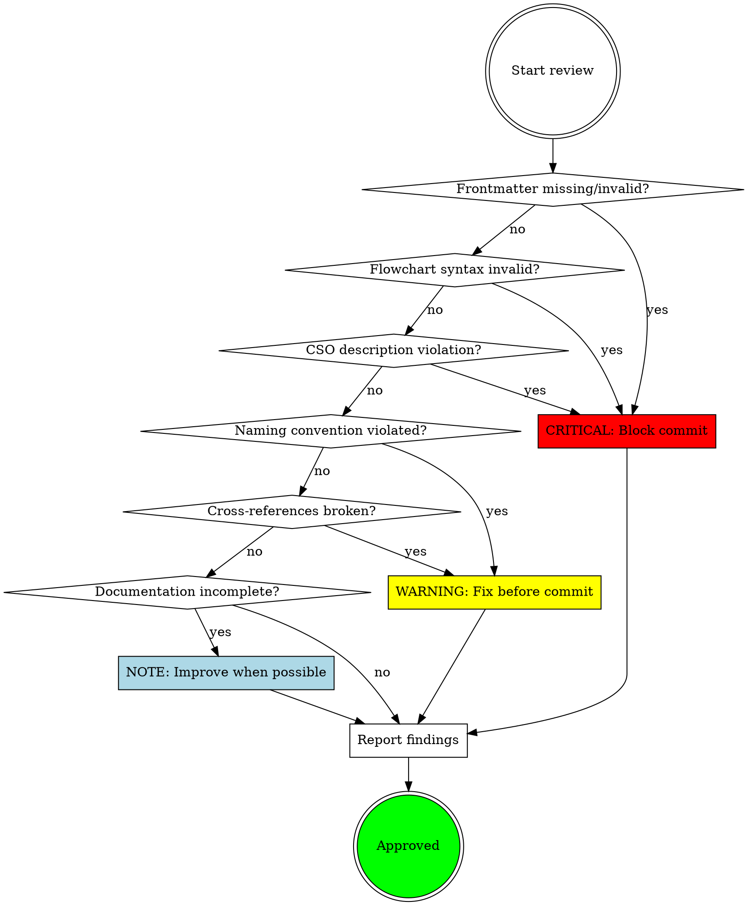

# Skill Review

Pre-commit review for Claude Code skills to ensure structural integrity, CSO compliance,
and documentation completeness before committing to the repository.

## When to Use This Skill

**Only for type: skills repositories.**

This skill is invoked by `git-commit` when:
- CLAUDE.md declares `type: skills`
- Staged changes include SKILL.md files

**Do NOT use this skill for:**
- type: java repositories (use java-code-review instead)
- type: custom repositories (no SKILL.md files)
- type: generic repositories (no SKILL.md files)

## Core Rules

- **Only operates in type: skills repositories** — other project types don't have SKILL.md files
- **Block commits on CRITICAL findings** — structural violations must be fixed first
- Focus on **format compliance and conventions**, not subjective quality
- Check **cross-references bidirectionally** — if A references B, verify B references A
- Validate **Graphviz syntax** — invalid flowcharts break skill loading
- Ensure **CSO description compliance** — no workflow summaries in frontmatter

## Workflow

### Step 1 — Identify skills to review

**If specific skill provided:**
```bash
ls <skill-path>/SKILL.md
```

**If reviewing staged changes:**
```bash
git diff --staged --name-only | grep 'SKILL.md$'
```

**If no context:**
Ask user which skill(s) to review.

### Step 2 — Review each skill

For each SKILL.md, run all checks systematically:

1. **Read the full file** (always read, never assume)
2. **Check frontmatter** (CRITICAL: name, description, CSO compliance)
3. **Validate flowcharts** (if present, test with `dot`)
4. **Check naming conventions** (match against patterns)
5. **Verify cross-references** (read referenced skills to confirm bidirectional)
6. **Check documentation completeness** (Success Criteria, Common Pitfalls, Prerequisites)

### Step 3 — Present findings

Group findings by severity:

```markdown
## Skill: skill-name

### CRITICAL Issues (must fix before commit)
- [Issue description with line reference]

### WARNING Issues (fix before commit)
- [Issue description with line reference]

### NOTE Issues (improve when possible)
- [Issue description with line reference]
```

**If CRITICAL findings exist:**
> "❌ **Cannot commit.** Fix CRITICAL issues first, then re-review."

**If only WARNING/NOTE findings:**
> "⚠️ **Fix warnings before commit.** Notes can be addressed later."

**If no findings:**
> "✅ **Approved.** Skill meets all structural requirements."

### Step 4 — Verify cross-references

When skill references another skill, read that skill to verify:

**Prerequisites pattern:**
```markdown
## Prerequisites

**This skill builds on `other-skill`**. Apply all rules from:
- **other-skill**: [specific rules]
```

Check: Does `other-skill/SKILL.md` exist? Does it make sense as a foundation?

**Skill Chaining pattern:**
```markdown
## Skill Chaining

**Chains to other-skill:**
After [milestone], invoke other-skill for [purpose].
```

Check: Does `other-skill/SKILL.md` mention being invoked by this skill?

### Step 5 — Test flowcharts (if present)

Extract flowchart blocks and test:

```bash
# Extract flowchart from markdown (between ```dot and ```)
sed -n '/```dot/,/```/p' <skill-path>/SKILL.md | sed '1d;$d' > /tmp/test.dot

# Test validity
dot -Tsvg /tmp/test.dot > /dev/null 2>&1
if [ $? -eq 0 ]; then
  echo "✅ Flowchart syntax valid"
else
  echo "❌ CRITICAL: Flowchart syntax invalid"
fi
```

## Review Severity Decision Flow



## Common Pitfalls

| Mistake | Why It's Wrong | Fix |
|---------|----------------|-----|
| Using in non-skills repositories | Wrong project type, no SKILL.md files | Only invoke for type: skills repositories |
| Workflow summary in description | Claude follows description instead of reading skill body (skill becomes expensive wallpaper) | Remove workflow details, describe *when to use* only |
| Missing name or description field | Skill won't load | Add required frontmatter fields |
| Generic flowchart labels | Unreadable, unclear intent | Use semantic labels (e.g., "Check BOM alignment" not "step1") |
| Dangling cross-references | Skill references non-existent skill | Verify all referenced skills exist |
| Missing Success Criteria | Premature completion claims | Add checklist for artifact-producing skills |
| Invalid Graphviz syntax | Skill loading fails | Test with `dot` before committing |
| Unidirectional chaining | Incomplete documentation graph | Make cross-references bidirectional |
| First-person in description | Injected into system prompt | Use third person ("Use when..." not "I help you...") |
| No Common Pitfalls table | Users repeat known mistakes | Document mistakes with fixes |

## Success Criteria

Skill review is complete when:

- ✅ All SKILL.md files read
- ✅ Frontmatter validated (name, description, CSO compliance)
- ✅ Flowcharts tested (if present)
- ✅ Naming conventions checked
- ✅ Cross-references verified bidirectionally
- ✅ Documentation completeness assessed
- ✅ Findings presented grouped by severity

**Not complete until** all checks performed and user informed of results.

## Skill Chaining

**Invoked by:** [`git-commit`] when SKILL.md files are detected in staged changes

**Invokes:** None (terminal skill in the chain)

**Can be invoked independently:** User can run `/skill-review` directly to validate skills before committing

**Chains to:** [`git-commit`] after approval (or after fixing CRITICAL/WARNING issues)

**Works alongside:** `update-claude-md` (documents workflow conventions), `update-readme` (syncs README with skill changes)

## Review Checklist

### Frontmatter Structure (CRITICAL)

| Check | What to verify |
|-------|---------------|
| **name field** | Present, matches directory name, uses hyphens (not underscores/spaces) |
| **description field** | Present, starts with "Use when...", under 500 chars |
| **No workflow summary** | Description describes *when to use*, not *how it works* |
| **Third person** | No "I" or "you" in description |
| **YAML syntax** | Valid YAML, `>` for multi-line descriptions |

**CSO violations are CRITICAL** — descriptions that summarize workflow cause Claude to
skip reading the skill body.

❌ Bad: `description: Use when executing plans - dispatches subagent per task with code review between tasks`

✅ Good: `description: Use when executing implementation plans with independent tasks in the current session`

### Naming Conventions (WARNING)

| Pattern | Examples |
|---------|----------|
| Generic principles | `*-principles` suffix: `code-review-principles`, `security-audit-principles` |
| Language-specific | Language prefix: `java-dev`, `java-code-review`, `python-dev` |
| Tool-specific | Tool prefix: `maven-dependency-update`, `gradle-dependency-update` |
| Framework-specific | Framework prefix: `quarkus-flow-dev`, `spring-security-audit` |

**Check:**
- ✅ Name follows hierarchical pattern (generic vs specific)
- ✅ Prefix/suffix matches skill's scope
- ✅ Hyphen-separated (not underscore or camelCase)

### Cross-References (WARNING)

| Section | What to verify |
|---------|---------------|
| **Prerequisites** | Layered skills reference their foundations |
| **Skill Chaining** | Bidirectional references (if A → B, then B mentions A) |
| **Invocation claims** | If skill says "invoked by X", verify X actually invokes it |

**Check:**
- ✅ All referenced skills exist
- ✅ Cross-references are bidirectional where appropriate
- ✅ No dangling references (skill doesn't exist)

### Flowcharts (CRITICAL if present)

| Check | What to verify |
|-------|---------------|
| **Valid Graphviz** | Syntax is valid `digraph` with proper node/edge format |
| **Semantic labels** | No generic labels like `step1`, `helper2`, `pattern3` |
| **Appropriate use** | Used for decisions, not for reference material or linear steps |

**Invalid flowcharts break skill loading** — this is CRITICAL.

Test validity:
```bash
echo 'digraph test { ... }' | dot -Tsvg > /dev/null 2>&1 && echo "valid" || echo "INVALID"
```

### Documentation Completeness (NOTE)

| Skill Type | Required Sections |
|------------|------------------|
| **All skills** | Skill Chaining or Prerequisites section |
| **Artifact-producing** | Success Criteria section with checkboxes |
| **Major skills** | Common Pitfalls table (Mistake \| Why It's Wrong \| Fix) |
| **Layered skills** | Prerequisites section referencing foundations |

**Check:**
- ✅ Success Criteria present for skills that produce artifacts (commits, ADRs, updates)
- ✅ Common Pitfalls table for major skills
- ✅ Prerequisites for skills that build on others

### File Organization (NOTE)

| Check | What to verify |
|-------|---------------|
| **Heavy reference** | >300 line reference material extracted to separate `.md` files |
| **Skill body focus** | SKILL.md focuses on workflow/principles, not exhaustive API docs |
| **Clear references** | External files referenced clearly from SKILL.md |

## Edge Cases

| Situation | Action |
|-----------|--------|
| Skill has no flowcharts | Skip flowchart validation |
| Generic `-principles` skill | Verify it's NOT invoked directly, only referenced via Prerequisites |
| Skill references external file | Verify file exists in skill directory |
| Multiple SKILL.md files staged | Review all, report findings together |
| Skill naming doesn't match pattern | WARNING if functional, NOTE if just style |
