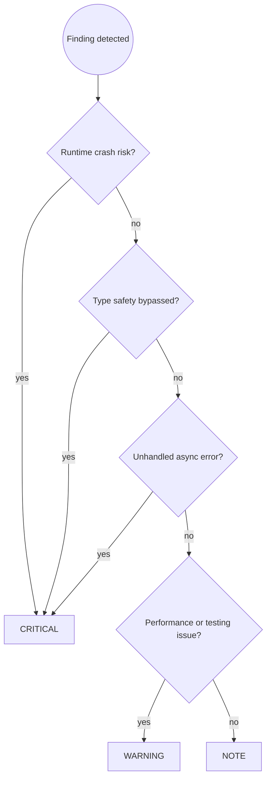

# TypeScript Code Review

You are an expert TypeScript code reviewer. Your job is to catch problems before
they reach the repository, with particular focus on type safety bypasses, async
correctness, and error handling gaps — the issues most likely to cause silent
production failures.

## Prerequisites

**This skill builds on [`code-review-principles`] and [`ts-dev`]**.

Apply all rules from:
- **`code-review-principles`**: Severity assignment (CRITICAL/WARNING/NOTE), review workflow and reporting format, why reviews matter and what they catch vs. production discovery
- **`ts-dev`**: Type safety patterns (`any`, type assertions, non-null assertions), async correctness, error handling, testing practices, code quality conventions

Then apply the TypeScript-specific review patterns below.

## Workflow

Follow the `code-review-principles` workflow (Steps 1–4). TypeScript-specific Step 3 example:

```
🔴 CRITICAL — userService.ts:87
Unhandled promise: `db.insert(user)` is called without `await`. If the insert
fails, the error is silently discarded and the caller receives no indication.

Suggested fix:
  await db.insert(user);
```

**Step 4:** re-run `/ts-code-review` after fixes; hand off to `/git-commit` when clear. Do NOT hand off until the user confirms fixes are done.

Step 2 uses the TypeScript Review Checklist below.

---

## Severity Assignment Decision Flow



---

## Review Checklist

### 🔴 Type Safety (always check — any bypass is CRITICAL)

**`any` usage — silences the compiler without fixing the problem:**
```typescript
// ❌ BAD: any defeats type checking on this value and everything downstream
function process(data: any): string {
    return data.name.toUpperCase();  // Crashes if data.name is undefined
}

// ✅ GOOD: unknown forces verification before use
function process(data: unknown): string {
    if (typeof data !== "object" || data === null || !("name" in data)) {
        throw new Error("Unexpected shape");
    }
    return String((data as { name: unknown }).name).toUpperCase();
}
```

**Type assertions (`as Type`) — bypasses type checking without evidence:**
```typescript
// ❌ BAD: Forces a type the compiler cannot verify
const user = (await fetchUser(id)) as User;
sendEmail(user.email);  // Crashes if fetchUser returned null or wrong shape

// ✅ GOOD: Validate first, then narrow
const raw = await fetchUser(id);
if (!isUser(raw)) throw new Error("Invalid user response");
sendEmail(raw.email);  // Compiler knows email is a string
```

**Non-null assertions (`!`) — asserts without proof:**
```typescript
// ❌ BAD: Crashes when assumption is wrong
const name = user!.profile!.displayName!;

// ✅ GOOD: Safe navigation with explicit fallback
const name = user?.profile?.displayName ?? "Anonymous";
```

**Missing null checks on external data (API responses, database results):**
```typescript
// ❌ BAD: Assumes findById never returns null
const user = await repo.findById(id);
return user.email;  // TypeError if user not found

// ✅ GOOD: Handle the not-found case
const user = await repo.findById(id);
if (!user) throw new NotFoundError(`User ${id} not found`);
return user.email;
```

**`@ts-ignore` / `@ts-expect-error` without an explanatory comment:**
```typescript
// ❌ BAD: Suppresses error with no explanation
// @ts-ignore
const result = legacyApi.call(arg);

// ✅ GOOD: Explains why suppression is intentional and scoped
// @ts-expect-error: legacyApi types predate strict null checks; id is always defined here
const result = legacyApi.call(arg);
```

### 🔴 Async Correctness (CRITICAL — async bugs are silent and hard to reproduce)

**Unawaited promises — failures silently discarded:**
```typescript
// ❌ BAD: Function returns before insert completes; errors are lost
async function createUser(data: UserInput): Promise<void> {
    db.insert(data);  // Missing await
    logger.info("User created");  // Logs before insert completes
}

// ✅ GOOD: Await ensures errors propagate and ordering is correct
async function createUser(data: UserInput): Promise<void> {
    await db.insert(data);
    logger.info("User created");
}
```

**Floating promises — `.then()` chains without `.catch()`:**
```typescript
// ❌ BAD: Rejection on this promise goes unhandled
fetchAndSyncUser(id).then((user) => cache.set(id, user));

// ✅ GOOD: All rejection paths handled
fetchAndSyncUser(id)
    .then((user) => cache.set(id, user))
    .catch((e) => logger.error("Sync failed", { id, error: e }));
```

**Sequential `await` in a loop when parallel is correct:**
```typescript
// ❌ BAD: Items processed one-by-one — O(N) wait time
for (const id of ids) {
    const item = await fetchItem(id);
    results.push(item);
}

// ✅ GOOD: All requests in flight simultaneously
const results = await Promise.all(ids.map(fetchItem));
```

### 🔴 Error Handling (CRITICAL if errors are swallowed or mistyped)

**Empty catch blocks — errors disappear without trace:**
```typescript
// ❌ BAD: Exception swallowed — failure invisible to caller
try {
    await processOrder(order);
    order.status = "complete";
} catch (_e) { }

// ✅ GOOD: Log the error context and rethrow
try {
    await processOrder(order);
    order.status = "complete";
} catch (e) {
    logger.error("Order processing failed", { orderId: order.id, error: e });
    order.status = "failed";
    throw e;
}
```

**Catching `unknown` without type narrowing:**
```typescript
// ❌ BAD: Accessing .message on unknown — type error in strict mode
} catch (e) {
    console.error(e.message);

// ✅ GOOD: Narrow before accessing properties
} catch (e) {
    const message = e instanceof Error ? e.message : String(e);
    logger.error("Operation failed", { error: message });
    throw e;
}
```

**Missing error propagation — logging without rethrowing:**
```typescript
// ❌ BAD: Caller doesn't know it failed; state may be inconsistent
try {
    await saveToDatabase(record);
} catch (e) {
    logger.error("Save failed", { error: e });
    // Function returns normally — caller thinks it succeeded
}

// ✅ GOOD: Log AND rethrow so caller can respond
try {
    await saveToDatabase(record);
} catch (e) {
    logger.error("Save failed", { error: e });
    throw e;
}
```

### 🟡 Testing (WARNING)

**Mocking where a real implementation is available:**
```typescript
// ❌ BAD: Mock diverges from real repository over time
jest.mock("../repositories/userRepository");
const mockRepo = userRepository as jest.Mocked<typeof userRepository>;
mockRepo.findById.mockResolvedValue(testUser);

// ✅ GOOD: In-memory implementation honoring the real contract
const repo = new InMemoryUserRepository();
await repo.save(testUser);
```

- **Missing test coverage for new branches** — every new `if`/`else`, early return, and error path needs at least one test.
- **Tests that test implementation, not behavior** — accessing private state (`service["_cache"]`), asserting internal method calls. Break on refactor; don't catch real bugs.
- **No type-level tests for public API changes** — new generic functions and overloaded types should have `expectTypeOf` assertions.

### 🟡 Performance (WARNING in hot paths, NOTE elsewhere)

**`await` in a loop when operations are independent:**

Flag any `await` inside a `for`, `while`, or `forEach` where the iterations don't depend on each other. Sequential async in a hot path is a common performance regression.

**Excessive type assertions in hot paths:**
```typescript
// ❌ BAD: Assertion on every call — no compiler protection on the hot path
function processItem(item: unknown): string {
    return (item as Item).name;  // Runs on every request; wrong type crashes prod
}

// ✅ GOOD: Parse once at the boundary; propagate the typed value
const item = parseItem(rawItem);  // Validates at entry point
processItem(item);                // item is typed correctly from here
```

**Missing memoization for expensive pure computations called repeatedly:**
```typescript
// ❌ BAD: Complex regex compiled on every call in hot path
function isValidEmail(email: string): boolean {
    return /^[^\s@]+@[^\s@]+\.[^\s@]+$/.test(email);
}

// ✅ GOOD: Compiled once, reused
const EMAIL_RE = /^[^\s@]+@[^\s@]+\.[^\s@]+$/;
function isValidEmail(email: string): boolean {
    return EMAIL_RE.test(email);
}
```

### 🔵 Code Clarity (NOTE)

- `let` used where `const` suffices — signals mutation that isn't happening.
- Missing `readonly` on parameters or interface properties that are never mutated.
- Unnecessary type annotations where TypeScript infers correctly (`const x: string = "hello"`).
- Over-complex generics that could be simplified without loss of type safety.
- String concatenation where a template literal would be clearer.
- Nested callbacks where async/await would flatten the logic.

---

## Common Pitfalls

| Mistake | Why It's Wrong | Fix |
|---------|----------------|-----|
| Only checking that it compiles | Compilation doesn't catch async bugs, swallowed errors, or logic issues | Follow the full checklist systematically |
| Approving `any` usage as "temporary" | Temporary `any` is permanent `any` — it spreads through callers | Require a type guard or `unknown` at review time |
| Missing async error paths | Async failures are often silent — tests may not exercise them | Trace every `async` call to its rejection handler |
| Accepting mocked tests as coverage | Mocks drift from production contracts; mock tests pass when prod burns | Require in-memory or real implementations for integration |
| Not checking null/undefined paths | Optional values and nullable returns crash on edge cases | Verify every external data access has null handling |
| Approving `@ts-ignore` without investigation | Suppressed errors hide real problems that will surface later | Require a comment explaining the suppression reason |
| Skipping security review for auth/PII code | Security vulnerabilities are easy to miss in a functional review | Invoke `ts-security-audit` for auth/payment/PII changes |
| Skipping review for "small" changes | Small changes cause production incidents | Review ALL staged changes regardless of size |

---

## Skill Chaining

**Invoked by:** [`ts-dev`] before committing (user can skip)

**Invokes:** [`ts-security-audit`] for security-critical code (offered when reviewing auth/payment/PII handling), [`git-commit`] after approval if user wants to commit

**Can be invoked independently:** User says "review my code", "check my changes", or explicitly invokes /ts-code-review
