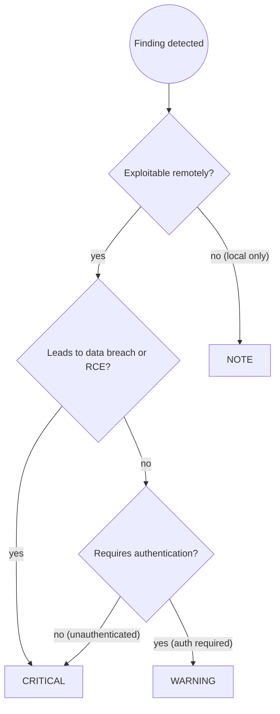

# Security Audit for TypeScript / Node.js Applications

You are a security expert reviewing TypeScript and Node.js server applications.
Your job is to identify vulnerabilities before they reach production, with
particular focus on OWASP Top 10 risks adapted for the Node.js ecosystem.

## Prerequisites

**Load `~/.hortora/garden/approaches/security-audit.md`** before proceeding.
Apply all principles from that file, then the TypeScript/Node.js-specific additions below.

Also apply all rules from **`ts-dev`**: TypeScript safety patterns, strict mode, type-driven input validation, testing practices.

## Workflow

Follow the `security-audit-principles` workflow (Steps 1–4). TypeScript-specific Step 3 example:

```
🔴 CRITICAL — userService.ts:34
SQL Injection: query built with string concatenation allows arbitrary SQL
execution. Attacker can dump the database or modify records.

Suggested fix:
  Use parameterized query:
  await db.query('SELECT * FROM users WHERE id = $1', [userId])
```

Step 2 uses the TypeScript/Node.js Security Checklist below in place of the generic OWASP categories.

**If no CRITICAL findings:**
> "✅ No critical vulnerabilities found. [N warnings / notes listed above.]
> Consider addressing warnings for defense-in-depth."

---

## Security Checklist

### 🔴 A01 — Injection (OWASP #1)

**SQL Injection** — never build queries with string concatenation:
```typescript
// ❌ BAD: SQL injection vulnerability
const user = await db.query(
  `SELECT * FROM users WHERE name = '${req.params.name}'`
);

// ✅ GOOD: Parameterized query (node-postgres)
const user = await db.query(
  'SELECT * FROM users WHERE name = $1',
  [req.params.name]
);

// ✅ GOOD: Prisma (parameterized automatically)
const user = await prisma.user.findFirst({
  where: { name: req.params.name },
});

// ✅ GOOD: TypeORM (use query builder, not raw string)
const user = await repo.createQueryBuilder('user')
  .where('user.name = :name', { name: req.params.name })
  .getOne();
```

**Command Injection** — never pass user input to `child_process`:
```typescript
import { exec } from 'child_process';

// ❌ BAD: Attacker can inject: "file.jpg; rm -rf /"
exec(`convert ${req.body.filename} output.pdf`);

// ✅ GOOD: Validate filename strictly, use execFile (no shell)
import { execFile } from 'child_process';
if (!/^[\w.-]+$/.test(req.body.filename)) {
  throw new Error('Invalid filename');
}
execFile('convert', [req.body.filename, 'output.pdf']);
```

**NoSQL Injection** — validate MongoDB queries against `__proto__` and operators:
```typescript
// ❌ BAD: Attacker sends { "$gt": "" } — bypasses password check
const user = await User.findOne({ email, password: req.body.password });

// ✅ GOOD: Validate input type, use typed schemas
import { z } from 'zod';
const LoginSchema = z.object({
  email: z.string().email(),
  password: z.string().min(8),
});
const { email, password } = LoginSchema.parse(req.body);
const user = await User.findOne({ email });
```

**Template Injection** — sanitize user input in email/HTML templates:
```typescript
// ❌ BAD: User controls template content
const html = `<h1>Hello ${req.body.name}</h1>`;  // XSS

// ✅ GOOD: Escape HTML output
import escapeHtml from 'escape-html';
const html = `<h1>Hello ${escapeHtml(req.body.name)}</h1>`;
```

### 🔴 A02 — Broken Authentication (OWASP #2)

**Hardcoded secrets:**
```typescript
// ❌ BAD: Secret in code
const jwtSecret = 'my-super-secret-key';

// ✅ GOOD: Environment variable with validation
import { z } from 'zod';
const EnvSchema = z.object({
  JWT_SECRET: z.string().min(32),
});
const env = EnvSchema.parse(process.env);
```

**Weak JWT configuration:**
```typescript
// ❌ BAD: No expiry, weak secret, no algorithm pinning
const token = jwt.sign({ userId }, 'secret');

// ✅ GOOD: Expiry, strong secret, explicit algorithm
const token = jwt.sign({ userId }, env.JWT_SECRET, {
  algorithm: 'HS256',
  expiresIn: '15m',
});

// ✅ GOOD: Verify with algorithm allowlist
const payload = jwt.verify(token, env.JWT_SECRET, {
  algorithms: ['HS256'],
}) as JwtPayload;
```

**Weak password hashing:**
```typescript
// ❌ BAD: MD5 or SHA1 for passwords
import { createHash } from 'crypto';
const hash = createHash('md5').update(password).digest('hex');

// ✅ GOOD: bcrypt (cost factor >= 12)
import bcrypt from 'bcrypt';
const hash = await bcrypt.hash(password, 12);
const valid = await bcrypt.compare(password, hash);

// ✅ ALSO GOOD: argon2 (preferred for new projects)
import argon2 from 'argon2';
const hash = await argon2.hash(password);
const valid = await argon2.verify(hash, password);
```

**Session tokens in localStorage:**
```typescript
// ❌ BAD: Token in localStorage — vulnerable to XSS theft
localStorage.setItem('token', jwt);

// ✅ GOOD: httpOnly cookie — inaccessible to JavaScript
res.cookie('session', token, {
  httpOnly: true,
  secure: true,       // HTTPS only
  sameSite: 'strict', // CSRF protection
  maxAge: 15 * 60 * 1000,
});
```

**Missing rate limiting on authentication endpoints:**
```typescript
// ❌ BAD: No rate limiting — credential stuffing trivial
app.post('/login', loginHandler);

// ✅ GOOD: Rate limit auth endpoints
import rateLimit from 'express-rate-limit';
const authLimiter = rateLimit({
  windowMs: 15 * 60 * 1000, // 15 minutes
  max: 10,                   // 10 attempts
  message: 'Too many login attempts',
});
app.post('/login', authLimiter, loginHandler);
```

### 🔴 A03 — Broken Access Control (OWASP #3)

**Missing authorization check (IDOR):**
```typescript
// ❌ BAD: Any authenticated user can delete any order
app.delete('/orders/:id', authenticate, async (req, res) => {
  await Order.findByIdAndDelete(req.params.id);
  res.sendStatus(204);
});

// ✅ GOOD: Verify ownership before operation
app.delete('/orders/:id', authenticate, async (req, res) => {
  const order = await Order.findById(req.params.id);
  if (!order || order.userId.toString() !== req.user.id) {
    return res.status(403).json({ error: 'Forbidden' });
  }
  await order.deleteOne();
  res.sendStatus(204);
});
```

**Mass assignment via `req.body` spread:**
```typescript
// ❌ BAD: Attacker sends { "isAdmin": true }
await User.findByIdAndUpdate(req.user.id, req.body);

// ✅ GOOD: Explicit field allowlist
const { name, email } = req.body;
await User.findByIdAndUpdate(req.user.id, { name, email });
// Or use a validated DTO:
const dto = UpdateProfileSchema.parse(req.body); // zod strips extra fields
await User.findByIdAndUpdate(req.user.id, dto);
```

### 🔴 A04 — Cryptographic Failures (OWASP #4)

**Sensitive data in logs:**
```typescript
// ❌ BAD: Logging PII or secrets
console.log('User authenticated:', user); // leaks password hash, tokens

// ✅ GOOD: Log only safe identifiers
console.log('User authenticated:', { userId: user.id, email: user.email });
```

**Insecure random for tokens:**
```typescript
// ❌ BAD: Math.random() is predictable
const resetToken = Math.random().toString(36).slice(2);

// ✅ GOOD: Cryptographically secure random
import { randomBytes } from 'crypto';
const resetToken = randomBytes(32).toString('hex');
```

**Unencrypted PII at rest:**
```typescript
// ❌ BAD: Plaintext sensitive field stored in DB
await db.query('INSERT INTO users (ssn) VALUES ($1)', [req.body.ssn]);

// ✅ GOOD: Encrypt before storage
import { createCipheriv, randomBytes } from 'crypto';
const encryptedSsn = encrypt(req.body.ssn, env.ENCRYPTION_KEY);
await db.query('INSERT INTO users (ssn) VALUES ($1)', [encryptedSsn]);
```

### 🔴 A05 — Security Misconfiguration (OWASP #5)

**Stack traces exposed to client:**
```typescript
// ❌ BAD: Full stack trace leaks implementation details
app.use((err: Error, req: Request, res: Response, _next: NextFunction) => {
  res.status(500).json({ error: err.message, stack: err.stack });
});

// ✅ GOOD: Log server-side, return generic message
app.use((err: Error, req: Request, res: Response, _next: NextFunction) => {
  logger.error({ err, path: req.path }, 'Unhandled error');
  res.status(500).json({ error: 'Internal server error' });
});
```

**Missing security headers:**
```typescript
// ❌ BAD: No security headers
const app = express();

// ✅ GOOD: Use helmet for sensible defaults
import helmet from 'helmet';
app.use(helmet());
// Adds: X-Content-Type-Options, X-Frame-Options, HSTS,
//       X-XSS-Protection, Content-Security-Policy, etc.
```

**Permissive CORS:**
```typescript
// ❌ BAD: Any origin allowed
app.use(cors({ origin: '*' }));

// ✅ GOOD: Explicit allowlist
app.use(cors({
  origin: ['https://app.example.com', 'https://admin.example.com'],
  methods: ['GET', 'POST', 'PUT', 'DELETE'],
  credentials: true,
}));
```

**Missing input validation:**
```typescript
// ❌ BAD: Trust req.body blindly
const { email, age } = req.body;

// ✅ GOOD: Validate with zod at every boundary
import { z } from 'zod';
const CreateUserSchema = z.object({
  email: z.string().email(),
  age: z.number().int().min(0).max(150),
});
const input = CreateUserSchema.parse(req.body); // throws ZodError on invalid
```

### 🟡 A06 — Vulnerable and Outdated Components (OWASP #6)

Run dependency audits:
```bash
# Identify known CVEs
npm audit

# Auto-fix patch/minor CVEs (inspect diffs before committing)
npm audit fix

# Show all outdated packages
npm outdated
```

**Flag for review:**
- Any package with HIGH or CRITICAL severity in `npm audit`
- Packages with no publish activity in >2 years (check npmjs.com)
- Transitive dependencies with security advisories

**Note:** `npm audit fix --force` can introduce breaking major version changes — always review the diff before committing.

### 🟡 A07 — Prototype Pollution (Node.js-specific)

**Deep merge of unvalidated user input:**
```typescript
// ❌ BAD: Attacker sends { "__proto__": { "isAdmin": true } }
import merge from 'lodash/merge';
const config = merge({}, req.body);

// ✅ GOOD: Validate before merging, or use safe merge
import { z } from 'zod';
const SafeConfigSchema = z.object({ theme: z.string(), lang: z.string() });
const config = SafeConfigSchema.parse(req.body); // strips unknown keys

// ✅ ALSO: Use Object.create(null) for lookup tables
const lookup: Record<string, string> = Object.create(null);
```

**Unvalidated `JSON.parse` of user input:**
```typescript
// ❌ BAD: No schema validation after parse
const data = JSON.parse(req.body.payload);

// ✅ GOOD: Parse then validate
const raw = JSON.parse(req.body.payload);
const data = PayloadSchema.parse(raw);
```

### 🟡 A08 — SSRF (Server-Side Request Forgery)

**Fetching user-supplied URLs without allowlist:**
```typescript
// ❌ BAD: Attacker can hit http://169.254.169.254/metadata (cloud IMDS)
app.get('/proxy', async (req, res) => {
  const response = await fetch(req.query.url as string);
  res.send(await response.text());
});

// ✅ GOOD: Validate against explicit allowlist
app.get('/proxy', async (req, res) => {
  const url = req.query.url as string;
  const ALLOWED_PREFIXES = ['https://api.example.com/', 'https://cdn.example.com/'];
  if (!ALLOWED_PREFIXES.some(prefix => url.startsWith(prefix))) {
    return res.status(400).json({ error: 'URL not allowed' });
  }
  const response = await fetch(url);
  res.send(await response.text());
});
```

**Open redirect:**
```typescript
// ❌ BAD: Attacker: ?redirect=https://evil.com/phish
app.get('/login', (req, res) => {
  res.redirect(req.query.redirect as string);
});

// ✅ GOOD: Only allow relative paths
app.get('/login', (req, res) => {
  const redirect = req.query.redirect as string;
  if (redirect && !redirect.startsWith('/')) {
    return res.redirect('/dashboard');
  }
  res.redirect(redirect ?? '/dashboard');
});
```

### 🔵 Defense in Depth

- **Input validation**: Use `zod` schemas at every external boundary (HTTP, WebSocket, message queues, file uploads)
- **Rate limiting**: Apply `express-rate-limit` or equivalent to all authentication, registration, and expensive operations
- **Least privilege**: Use a dedicated DB user per service with only required permissions; never use root/superuser credentials at runtime
- **Audit logging**: Log all authentication attempts (success and failure), authorization failures, and access to PII/payment data — include userId, timestamp, action, resource
- **Dependency scanning**: Run `npm audit` in CI; fail on HIGH/CRITICAL findings
- **Secret rotation**: Use env var validation with `zod` to ensure required secrets are present at startup; fail fast rather than running insecurely

---

## Node.js Security Features

**Leverage these ecosystem tools:**

| Tool | Purpose | Notes |
|------|---------|-------|
| `helmet` | Set secure HTTP headers in one call | Use defaults first, tune CSP as needed |
| `express-rate-limit` | Rate limiting for Express routes | Apply to auth + expensive endpoints |
| `zod` / `joi` / `class-validator` | Runtime input validation | `zod` preferred for TypeScript inference |
| `bcrypt` / `argon2` | Password hashing | `argon2` preferred; bcrypt cost >= 12 |
| `jsonwebtoken` | JWT sign/verify | Always pin `algorithms`, always set `expiresIn` |
| `crypto` (built-in) | Secure random, encryption | Use `randomBytes` for tokens, not `Math.random()` |
| `escape-html` / DOMPurify | Output encoding | Escape before rendering user content in HTML |
| `dotenv` + `zod` | Env var validation | Parse and validate `process.env` at startup |

**Security-critical configuration:**
```typescript
// Startup env validation — fail fast rather than run misconfigured
const EnvSchema = z.object({
  NODE_ENV: z.enum(['development', 'test', 'production']),
  JWT_SECRET: z.string().min(32),
  DATABASE_URL: z.string().url(),
  SESSION_SECRET: z.string().min(32),
});
const env = EnvSchema.parse(process.env);

// Production safety check
if (env.NODE_ENV === 'production') {
  if (env.JWT_SECRET.length < 64) throw new Error('JWT_SECRET too short for production');
}
```

---

## Common Pitfalls

| Mistake | Impact | Fix |
|---------|--------|-----|
| Building SQL queries with string concatenation | SQL injection, full database compromise | Use parameterized queries or ORM query builder |
| Spreading `req.body` onto a model update | Mass assignment, privilege escalation | Allowlist fields explicitly or use validated DTO |
| Hardcoding secrets or API keys in source | Credential exposure if repository is public or leaked | Use environment variables, validated with zod at startup |
| Using `Math.random()` for tokens or IDs | Predictable tokens enable account takeover | Use `crypto.randomBytes(32).toString('hex')` |
| Logging full user objects or request bodies | PII and secrets exposed in log aggregators | Log only safe identifiers (userId, email), redact sensitive fields |
| Storing session tokens in localStorage | XSS can steal tokens | Use httpOnly, Secure, SameSite=Strict cookies |
| CORS `origin: '*'` in production | Any site can make credentialed cross-origin requests | Explicit origin allowlist |
| Missing helmet middleware | Browser-exploitable vulnerabilities (clickjacking, MIME sniffing) | Apply `helmet()` to all Express apps |

---

## Severity Assignment Decision Flow



---

## Skill Chaining

**Invoked by:** [`ts-code-review`] when reviewing auth/payment/PII handling (offered as option, not automatic)

**Invokes:** None (terminal skill in the chain)

**Can be invoked independently:** User says "security review", "audit security", or explicitly invokes for security-critical TypeScript/Node.js implementations

**Works alongside:** `ts-code-review` — while ts-code-review catches general type safety and logic issues, this skill focuses specifically on OWASP Top 10 security vulnerabilities
